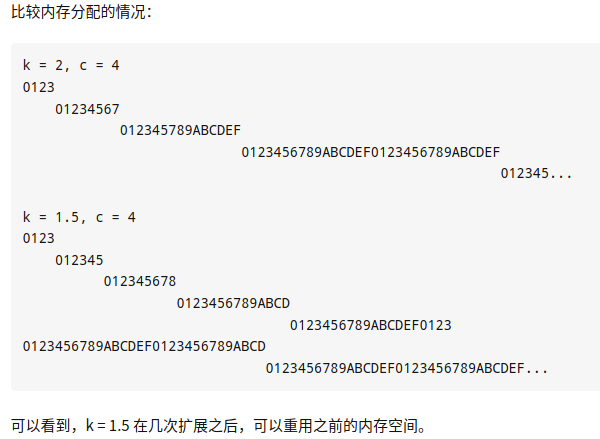

# STL

C++ STL从广义来讲包括了三类：算法，容器和迭代器。

- 算法包括排序，复制等常用算法，以及不同容器特定的算法。
- 容器就是数据的存放形式，包括序列式容器和关联式容器，序列式容器就是list，vector等，关联式容器就是set，map等。
- 迭代器就是在不暴露容器内部结构的情况下对容器的遍历。

**迭代器是STL的精髓，它提供了一种方法，使它能够按照顺序访问某个容器所含的各个元素，但无需暴露该容器的内部结构。它将容器和算法分开，好让这二者独立设计。**

容器，即存放数据的地方。比如array等。

在STL中，容器分为两类：序列式容器和关联式容器。

**序列式容器**，其中的元素不一定有序，但都可以被排序。如：vector、list、deque、stack、queue、heap、priority_queue。

**关联式容器**，内部结构基本上是一颗平衡二叉树。所谓关联，元素按照一定的规则存放（元素位置取决于特定的排序准则）。如：RB-tree、set、map、multiset、multimap、hashtable、hash_set、hash_map、hash_multiset、hash_multimap。

下面各选取一个作为说明。

vector：它是一个动态分配存储空间的容器。区别于c++中的array，array分配的空间是静态的，分配之后不能被改变，而vector会自动重分配（扩展）空间。

**使用 vector 时需要注意：每次插入和移除元素的时候，都会使作用点之后的各元素 references、pointers、iterators 失效，如果插入操作引发内存重新分配，那么该容器上所有的 references、pointers、iterators 都会失效。**

**set：其内部元素会根据元素的键值自动被排序。区别于map，它的键值就是实值，而map可以同时拥有不同的键值和实值。**

算法，如排序，复制……以及一些容器特定的算法。这点不用过多介绍，主要看下迭代器的内容。

## 迭代器

### 迭代器的种类

输入迭代器：是只读迭代器，在每个被遍历的位置上只能读取一次。例如find函数参数就是输入迭代器。

输出迭代器：是只写迭代器，在每个被遍历的位置上只能被写一次。

前向迭代器：兼具输入和输出迭代器的能力，但是它可以对同一个位置重复进行读和写。但它不支持operator–，所以只能向前移动。

双向迭代器：很像前向迭代器，只是它向后移动和向前移动同样容易。

随机访问迭代器：有双向迭代器的所有功能。而且，它还提供了“迭代器算术”，即在一步内可以向前或向后跳跃任意位置，  包含指针的所有操作，可进行随机访问，随意移动指定的步数。支持前面四种Iterator的所有操作，并另外支持it + n、it – n、it += n、 it -= n、it1 – it2和it[n]等操作。

### 迭代器失效的问题

- 插入操作

  对于vector和string，如果容器内存被重新分配，iterators,pointers,references失效；如果没有重新分配，那么插入点之前的iterator有效，插入点之后的iterator失效；

  对于deque，如果插入点位于除front和back的其它位置，iterators,pointers,references失效；当我们插入元素到front和back时，deque的迭代器失效，但reference和pointers有效；

  对于list和forward_list，所有的iterator,pointer和refercnce有效。

- 删除操作

  对于vector和string，删除点之前的iterators,pointers,references有效；off-the-end迭代器总是失效的；

  对于deque，如果删除点位于除front和back的其它位置，iterators,pointers,references失效；当我们插入元素到front和back时，off-the-end失效，其他的iterators,pointers,references有效；

  对于list和forward_list，所有的iterator,pointer和refercnce有效。

  对于关联容器map来说，如果某一个元素已经被删除，那么其对应的迭代器就失效了，不应该再被使用，否则会导致程序无定义的行为。

vector动态增加大小时，并不是在原空间后增加新的空间，而是以原大小的两倍在另外配置一片较大的新空间，然后将内容拷贝过来，并释放原来的空间。由于操作改变了空间，所以迭代器失效。

**为何map和set的插入删除效率比其它序列容器高，而且每次insert之后，以前保存的iterator不会失效？**

因为存储的是结点，不需要内存拷贝和内存移动。

因为插入操作只是结点指针换来换去，结点内存没有改变。而iterator就像指向结点的指针，内存没变，指向内存的指针也不会变。

**为何map和set不能像vector一样有个reserve函数来预分配数据?**

因为在map和set内部存储的已经不是元素本身了，而是包含元素的结点。也就是说map内部使用的Alloc并不是map<Key, Data, Compare, Alloc>声明的时候从参数中传入的Alloc。

## vector扩容原理

空间分配的多，平摊时间复杂度低，但浪费空间也多。 

使用 k = 2 增长因子的问题在于，每次扩展的新尺寸必然刚好大于之前分配的总和。也就是说，之前分配的内存空间不可能被使用。这样对于缓存并不友好。最好把增长因子设为  1 < k < 2，例如 k = 1.5这样，在几次扩容后，就可以重用之前的内存空间。

其实 C++ 标准也没有规定要用哪一个增长因子， VS2015中以1.5倍扩容，GCC以2倍扩容。

总结

1. vector在push_back以成倍增长可以在均摊后达到O(1)的时间复杂度，相对于增长指定大小的O(n)时间复杂度更好。
2. 为了防止申请内存的浪费，现在使用较多的有2倍与1.5倍的增长方式，而1.5倍的增长方式可以更好的实现对内存的重复利用，因为更好。



[C++ STL中vector内存用尽后，为啥每次是两倍的增长，而不是3倍或其他数值？](https://www.zhihu.com/question/36538542/answer/67929747)

## vector如何释放空间

由于vector的内存占用空间只增不减，比如你首先分配了10,000个字节，然后erase掉后面9,999个，留下一个有效元素，但是内存占用仍为10,000个。所有内存空间是在vector析构时候才能被系统回收。empty()用来检测容器是否为空的，clear()可以清空所有元素。但是即使clear()，vector所占用的内存空间依然如故，无法保证内存的回收。

如果需要空间动态缩小，可以考虑使用deque。如果vector，可以用swap()来帮助你释放内存。

```C++
 vector(Vec).swap(Vec); //将Vec的内存清除；
 vector().swap(Vec); //清空Vec的内存；
```

## vector 与 list 区别

- vector 与 array 一样，拥有一段连续的内存空间，支持随机存取。因为内存空间连续，所以在中间插入和删除会造成内存块的拷贝（时间复杂度O(n)）。另外，当连续的内存空间不足后，需要重新申请一块大内存，然后将之前的数据拷贝过去，这些都影响了vector的效率。
- list由双向链表实现，内存空间不连续。很好的支持删除与插入操作，但随机访问需要O(n)时间复杂度。
- vector<int>::iterator支持“+”，“+=”，“<”，“[]”，等等操作，list<int>::iterator不支持这些操作。list只能用“++”进行迭代。

对于vector来说，如果有大量的数据需要push_back，应该先用reserve()方法设定其大小，否则会出现多次容量扩充操作，影响效率。

## vector 与 deque

- vector是单向开口的连续线性空间， deque，由多个连续内存块构成，是一种双向开口的连续线性空间。所谓双向开口，意思是可以在头尾两端分别做元素的插入和删除操作。deque是list和vector的兼容，分为多个块，每一个块大小是512字节，块通过map块管理，map块里保存每个块得首地址。因此该容器也有索引操作operator[ ]，效率没vector高。另外，deque 比 vector 多了 push_front() 和 pop_front() 两个方法（vector 不支持），这两个方法都是对首部操作的，在两端进行此操作时与list的效率 差不多。
- deque没有所谓容量(capacity)观念，因为它是动态地以分段连续空间组合而成，随时可以增加一段新的空间并链接起来。


##  选择顺序容器的一些准则  

- 如果我们需要随机访问一个容器则vector要比list好得多 。
-  如果我们已知要存储元素的个数则vector 又是一个比list好的选择。   
- 如果我们需要的不只是在容器两端插入和删除元素则list显然要比vector好   
- 除非我们需要在容器首部插入和删除元素否则vector要比deque好。 
- 如果只在容易的首部和尾部插入数据元素，则选择deque. 
- 如果只需要在读取输入时在容器的中间位置插入元素，然后需要随机访问元素，则可考虑输入时将元素读入到一个list容器，接着对此容器重新排序，使其适合顺序访问，然后将排序后的list容器复制到一个vector容器中。

## map 与 hash_map 区别

- 底层数据结构不同：map 是红黑树（查找时间复杂度log(n)），hash_map 是哈希表（查找时间复杂度O(1)）

- map 的优点在于元素可以自动按照键值排序，而 hash map 的优点在于它的各项操作的平均时间复杂度接近常数

- map 属于标准的一部分，而 hash_map 则不是 


什么时候用map，什么时候用hash_map？

这个要看具体的应用，不一定常数级别的 hash_map 一定比 log(n) 级别的 map 要好， hash_map 的 hash 函数以及解决地址冲突等都要耗时间，构造很慢。众所周知 hash 表是以空间换时间的，因而 hash_map 的内存消耗肯定要大，一般情况下，如果记录非常大，考虑 hash_map，查找效率会高很多，如果要考虑内存消耗，则要谨慎使用hash_map。

【扩展】

map, set, multimap, and multiset 采用红黑树实现，**红黑树是平衡二叉树的一种**。不同操作的时间复杂度近似为:

插入: O(logN)

查看:O(logN)

删除:O(logN)

hash_map, hash_set, hash_multimap, and hash_multiset 采用哈希表实现，不同操作的时间复杂度为：

插入:O(1)，最坏情况O(N)。

查看:O(1)，最坏情况O(N)。

删除:O(1)，最坏情况O(N)。

### 红黑树

红黑树是每个节点都带有颜色属性的二叉查找树，颜色或红色或黑色。在二叉查找树强制一般要求以外，对于任何有效的红黑树我们增加了如下的额外要求:

性质1. 节点是红色或黑色。

性质2. 根节点是黑色。

性质3 每个红色节点的两个子节点都是黑色。(从每个叶子到根的所有路径上不能有两个连续的红色节点)

性质4. 从任一节点到其每个叶子的所有路径都包含相同数目的黑色节点。

这些约束强制了红黑树的关键性质:  从根到叶子的最长的可能路径不多于最短的可能路径的两倍长。结果是这个树大致上是平衡的。因为操作比如插入、删除和查找某个值的最坏情况时间都要求与树的高度成比例，这个在高度上的理论上限允许红黑树在最坏情况下都是高效的，而不同于普通的二叉查找树。

要知道为什么这些特性确保了这个结果，注意到性质3导致了路径不能有两个毗连的红色节点就足够了。最短的可能路径都是黑色节点，最长的可能路径有交替的红色和黑色节点。因为根据性质4所有最长的路径都有相同数目的黑色节点，这就表明了没有路径能多于任何其他路径的两倍长。

### map 底层为什么用红黑树而不是平衡二叉树（AVL）

**AVL 是有下列性质的二叉树：**

它的左子树和右子树都是平衡二叉树，且左子树和右子树的深度之差的绝对值不超过 1。 

 将二叉树上结点的左子树深度减去右子树深度的值称为平衡因子BF，那么平衡二叉树上的所有结点的平衡因子只可能是 -1、0 和 1。只要二叉树上有一个结点的平衡因子的绝对值大于1，则该二叉树就是不平衡的。 

红黑树是在AVL树的基础上提出来的。 

 **红黑树较AVL树的优点：** 

 AVL 树是高度平衡的，频繁的插入和删除，会引起频繁的 rebalance，导致效率下降；红黑树不是高度平衡的，算是一种折中，插入最多两次旋转，删除最多三次旋转。 

所以红黑树在查找，插入删除的性能都是 O(logn)，且性能稳定，所以 STL 里面很多结构包括 map 底层实现都是使用的红黑树。 

### STL 关联容器底层实现总结

**有序关联容器**底层实现为红黑树，增删改查时间复杂度O(n)。

set，multiset，map，multimap。

**无序关联容器**底层实现链式哈希表 ，增删改查时间复杂度O(1)。

unordered_set，unordered_multiset，unordered_map，unordered_multimap。

### map 和 unordered_map 的性能对比 

map内部是红黑树，在插入元素时会自动排序，而无序容器 unordered_map 内部是哈希表，通过哈希而不是排序来快速操作元素，使得效率更高。当你不需要排序时选择 unordered_map 的效率更高。 

## 容器内部删除一个元素

- 顺序容器（序列式容器，比如vector、deque）

  erase迭代器不仅使所指向被删除的迭代器失效，而且使被删元素之后的所有迭代器失效(list除外)，所以不能使用erase(it++)的方式，但是erase的返回值是下一个有效迭代器；

  ```C++
  it = c.erase(it);
  ```

- 关联容器(关联式容器，比如map、set、multimap、multiset等)

  erase迭代器只是被删除元素的迭代器失效，但是返回值是void，所以要采用erase(it++)的方式删除迭代器；

  ```C++
  c.erase(it++)
  ```

vector erase成员函数，它删除了itVect迭代器指向的元素，并且返回要被删除的itVect之后的迭代器，迭代器相当于一个智能指针;

clear()函数，只能清空内容，不能改变容量大小;

如果要想在删除内容的同时释放内存，那么你可以选择deque容器。

## remove 和 erase 区别

- erase 一般作为一个 container 的成员函数，是真正删除的元素，是物理上的删除（迭代器访问不到了）
- algorithm 中的 remove 只是简单的把要 remove 的元素移到了最后面，后面的一系列元素前移，覆盖掉要remove的元素，是逻辑上的删除，此时容器的 size 不变化。因为 algorithm 通过迭代器操作，不知道容器的内部结构，所以无法做到真正删除。

```C++
template <class T>
void show(std::vector<T> &v)
{
    for (const auto &x : v)
    {
        std::cout << x << " ";
    }
    std::cout << std::endl;
}

int main()
{
    std::vector<int> vec{1, 2, 3, 3, 4, 5, 5};
    vec.erase(vec.begin());
    show(vec);

    auto pos = remove(vec.begin(), vec.end(), 4);
    show(vec);
    if (pos + 1 == vec.end())
    {
        std::cout << "move element to the end" << std::endl;
    }
    remove(vec.begin(), vec.end(), 3);
    show(vec);

    return 0;
}
/**
2 3 3 4 5 5 
2 3 3 5 5 5 
move element to the end
2 5 5 5 5 5 
*/
```


## 所有容器的共同操作(包括string 类)

- == 和 != 返回 true 或者 false，两个容器是否相等
- = 赋值，将一个容器赋给另一个容器
- size()  返回当前的容器的元素数量
- empty()  判断容器是否为空，这个操作比 size() == 0 更有利率
- max_size() 容器所能容纳的最大元素数量
- clear() 删除所有元素
- begin() ，rbegin()
- end(), rend()
- insert(it, val) 将单一或者某一个范围的元素插入容器内
- erase() 将容器内的单一或者某一个范围内的元素删除
- swap()

【ESC 76】

### 顺序容器

可序群集，每个元素位置取决于插入时机和地点，和元素值无关。如果以追加方式置入元素，那么他们的排列次序将和置入次序一致。

- array：数组

- vector: 以一块连续性内存来存放数据，适合随机访问，不适合插入/删除（在末尾插入/删除效率很高，在中间插入/删除就需要移动元素，不提供在首部插入的操作，因为效率低）
- list: 以**双向链接**而非连续内存来存储内容，适合插入/删除而不适合随机访问。
- forward_list：单链表
- deque: (双向队列)以连续内存存储数据，但是只能对最前端/末端的元素进行插入/删除操作

### 容器适配器：

- stack: 栈
- queue: 队列
- priority queue: 优先队列


#### vector

- vector<int> vec;  产生空的容器
- vector<int> vec(1024): 创建一个vector,元素个数为1024，对int 和double这种算术类型，不给初值，默认就是 0.
- vector<int> vec(1024, 42):创建一个vector，元素个数为1024,且值均为42
- vector<int> vec(begin,end):复制[begin,end)区间内另一个数组的元素到vector中，begin和end为指针或者迭代器
- vector<int> vec = {1, 2, 3, 4, 5}; // 像数组一样初始化，甚至可以去掉等于号。
- vec.push_back()
- vec.pop_back()
- vec.insert(it, val)
- size()  返回当前的容器的元素数量
- empty()  判断容器是否为空，这个操作比 size() == 0 更有利率
- max_size() 容器所能容纳的最大元素数量
- capacity() 重新分配空间前所能容纳的元素最大数量，看 reserve 预留多少
- reserve() 预留多少个元素

```C++
int main(int argc, char* argv[]) {
	vector<string> sen;
	sen.reserve(100);// 预留 100 个string空间，如果不预留，那么 capacity() 的输出就和 size() 一样
	vector<string>::iterator it = sen.begin();
	sen.push_back("hello");
	sen.push_back("world");
	sen.push_back("!");
	sen.insert(it, "ok");

	cout << sen.size() << endl;;		// 4
	cout << sen.max_size() << endl;		// 153391689
	cout << sen.capacity() << endl;		// 100

	it = sen.begin();	// 注意，insert() 会使插入的位置之后的所有 iterator 失效，故重新赋值
	vector<string>::iterator finish = sen.end();
	for (; it != finish; ++it)			// ok hello world !
		cout << *it << " ";				
	getchar();
}
```

```C++
vector<vector<char> >vec(row, vector<char>(col,'#'));//二维数组初始化
```

#### list

- insert(pos, elem)
- push_back(elem)
- pop_back()
- push_front()
- pop_front()

- remove(val) 移除所有值为 val 的元素
- remove_if(op) 移除所有造成op(elem)结果为 true 的元素
- erase(pos)
- erase(beg, end)
- clear()

#### deque

与 vector 接口几乎一样，deque 适合在两端操作，vector 没有在首部插入/删除的方法。要注意，在中间插入元素会导致 references、pointers、iterators 失效（两端没关系）

#### queue

- bool empty() const
- size_type size() const
- T& front() 返回指向队首元素的引用
- T& back() 返回指向队尾元素的引用
- void push(const T& x) 在队尾插入x
- void pop() 删除队首元素

#### stack

- bool empty() const
- size_type size() const
- T& top() 返回指向栈顶元素的引用
- void push(const T& x) 在栈顶插入x
- void pop() 删除栈顶元素

### 关联容器

已序群集，元素位置取决于特定的排序准则，如果置入元素，那么它们的位置取决于元素值，而与置入的次序无关。

自动排序造成一个重要限制：你不能直接改变元素值（只读），因为这样会打乱原本正确的顺序。因此，要改变元素值，必须先删除旧元素，再插入新元素。

- set: 内部元素有序，且只出现一次

- multiset: 与 set 相同，但允许重复的元素

- unordered_set：无序set，用哈希函数组织

- 
  unordered_multiset：关键字可重复的无序set


- map: 键值对，每个键只出现一次
- multimap: 与 map 相同，
- unordered_map：无序map
- unordered_multimap：关键字可重复的无序map

#### set

Set 由一群 key 组合而成，对于任何 key 值，set 只能存一份。

C++ 中，set 元素默认按照 less-than 顺序排列，这点跟 python 不一样，python里的 set 是无序的。

```C++
int ia[] = {3, 8, 8, 5, 3, 1, 5, 1};
vector<int> vec(ia, ia+8);
set<int> iset(vec.begin(), vec.end());
set<int>::iterator it = iset.begin();
for (; it != iset.end(); ++it)
    cout << *it << ' ';
//输出 1 3 5 8
```

- insert()  插入元素
- set_intersection()
- set_union()
- set_difference()
- set_symmetric_difference()

#### multiset

#### map

```C++
#include<iostream>
#include <map>
#include <string>
map<string, int> words;

words["good"] = 1;  //键 good 的值是 1
//如果一个key不在words钟，其默认值就为0
words["bad"];  // 0
//比如你想知道 words 中是否有 "python",第一种方法可以直接把 key当索引使用，
//但缺点是，若本无这个键，这样做就会添加这个键，虽然默认值为 0
if (words["python"]) {
    do something;  //如果 words 中有 "python"
}
//第二种做法是用map自带的find()函数。
map<string, int>::iterator it;
it = words.find("Python");
if (it != words.end() {
    do something;
    std::cout << it->second;
    //it->first 是 key，it->second 是 value
}
//第三种做法是利用map的count()函数
if (words.count("python")) {
    do something;
}
```

#### multimap

#### unordered_map 

#### unordered_multimap

### 算法

#### sort

```C++
#include <algorithm>
/* 函数sort(first, last, comp)；
first : 待排序数组起始地址；
last : 待排序数组结束地址；
comp : 排序方式，该参数是可省参数，如果省略则以升序方式排序；
*/
int vec[] = { 5, 1, 9, 4, 6, 7, 2, 0, 1 };
sort(vec, vec + 9); //就地改变，未使用 comp，默认按升序排列 
```

```C++
 bool comp(int a, int b) {
     return a > b;  //自己写排序规则，大的放在前面
 }
int vec[] = { 5, 1, 9, 4, 6, 7, 2, 0, 1 };
sort(vec, vec + 9, comp); //使用 comp，按自己的规则降序排列
```

#### reserve

#### find

#### for_each

#### STL方法

- 更多【ESC 78-92】
- [STL·语雀](https://www.yuque.com/huihut/interview/stl_document)
- [C++/boost数据结构](https://zhuanlan.zhihu.com/p/73000084)

