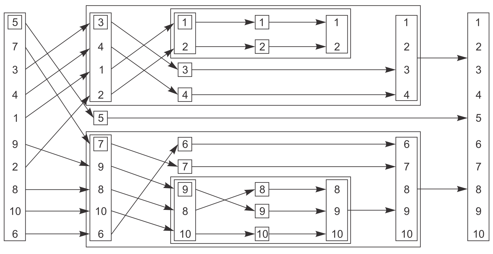

# 你好，C++ 并发世界

## 基本概念

以前，大部分计算机都只有一个处理器，具有单个处理单元和核心，这种计算机在某一时刻只可以真正执行一个任务，但它可以每秒切换任务许多次。通过做一点这个任务再做一点另一个任务，看起来像是任务在并发进行。这就是任务切换，我们仍然称这样的系统为并发(concurrency)。但这只是并发的假象。

对于多核处理器，它能真正的同时运行超过一个任务，称之为**硬件并发**（hardware concurrency）

对于单核处理器，每次执行上下文切换时，都需要时间。【P2】

## 使用并发的原因

使用并发的主要两个原因：关注点分离和性能。

- 关注点分离：将相关的代码放在一起，并将无关的代码分离，使程序易于理解和测试。如带有用户界面的密集处理型应用程序，可以将UI处理与数据处理分离。

- 性能：有两种方式为了 性能使用并发，任务并行和数据并行。
	- 任务并行：将单个任务分成几部分且各自并行运行，从而降低总运行时间。一个线程执行算法的一部分，另一个线程执行算法的另一部分。
	- 数据并行：每个线程在不同的数据部分执行同样的操作。一个线程执行数据的一部分，另一个线程执行数据的另一部分。

【P5~8】

## 什么时候不使用并发

除非潜在的性能增益足够大和关注点分离足够清晰。

启动线程时存有固定开销，因为操作系统需要分配相关的内核资源和堆栈空间，然后将新线程加入到调度器，这一切都需要时间。

此外，线程是有限的资源。如果让太多线程同时运行，则会消耗系统资源，并且使操作系统整体上运行得更慢。每个线程需要一个独立的堆栈空间，假设是1M，每个进程的可用内存和地址空间是有限的，对一个可用空间限制为4GB扁平架构的32位操作系统而言，4096个线程将会耗尽地址空间，导致不再为代码、静态数据或者堆数据留有空间。

**试图得到系统的最佳性能，考虑可用的硬件并发并调整运行线程的数量是必须的。**【p7~8】

对于IO密集型任务：

`线程数 = CPU核心数 × （1 + IO耗时 / CPU 耗时）`

对CPU密集型任务：

`线程数 = CPU 核心数 + 1`

## std::thread

```cpp
#include <iostream>
#include <thread>

void hello()
{
    std::cout<<"Hello Concurrent World\n";
}

int main()
{
    std::thread t(hello);
    t.join();
}
```

每个程序有一个执行 main() 函数的主线程，将函数添加为 std::thread 的参数即可启动另一个线程，两个线程会同时运行。

对于应用程序来说，初始线程起于main()，但对于新线程来说，它起于hello()。【P12】

# 管理线程

## 启动线程

std::thread 的参数也可以是函数对象或者 lambda 表达式【P14~15】

```cpp
// 1.1
struct A {
  void operator()() const { std::cout << 1; }
};

int main() {
  A a;
  std::thread t1(a);  // 会调用 A 的拷贝构造函数
  std::thread t2(A());  // most vexing parse，非常棘手的解析，声明函数名为 t2， 参数类型为 A 的函数，而不是启动一个线程。
  std::thread t3{A()};  // 改成花括号，使用初始化语法，解决上述的问题
  std::thread t4((A()));	// 或者多加一层括号避免将其解释为函数声明，从而让t4被声明为一个变量而不是一个函数。
  std::thread t5{[] { std::cout << 1; }};
  t1.join();
  t3.join();
  t4.join();
  t5.join();
}
```

## 等待线程完成

在std::thread对象销毁前要对其调用 [join](https://en.cppreference.com/w/cpp/thread/thread/join) 等待线程退出或 [detach](https://en.cppreference.com/w/cpp/thread/thread/detach) 将线程分离，否则 [std::thread](https://en.cppreference.com/w/cpp/thread/thread) 的析构函数会调用 [std::terminate](https://en.cppreference.com/w/cpp/error/terminate) 终止程序。如果分离线程，那么线程可能在std::thread对象被销毁后很久都在运行，这时需要保证该线程访问的数据都是有效的，直到该线程完成为止（注意分离线程可能出现空悬引用的隐患）【P15】

```cpp
// 2.1
void do_something(int &i)
{
    ++i;
}

struct func
{
    int &i;

    func(int &i_) : i(i_) {}

    void operator()()
    {
        for (unsigned j = 0; j < 1000000; ++j)
        {
            do_something(i);
        }
    }
};

void oops()
{
    int some_local_state = 0;
    func my_func(some_local_state);
    std::thread my_thread(my_func);
    // 不等待线程结束，oops 执行完，就释放了局部变量 some_local_state， my_func.i 为空悬引用
    my_thread.detach(); 
}

int main()
{
    oops(); // main 函数退出了，它所拥有的线程当然也会退出。
}
```

[join](https://en.cppreference.com/w/cpp/thread/thread/join) 会在线程结束后清理 [std::thread](https://en.cppreference.com/w/cpp/thread/thread)，使其与完成的线程不再关联，因此对一个线程只能进行一次 [join](https://en.cppreference.com/w/cpp/thread/thread/join)。在join之前，应该先调用joinable()来判断是否可以join()。

```cpp
int main() {
  std::thread t([] {});
  t.join();
  t.join();  // 错误
}
```

## 在异常环境下的等待

如果线程运行过程中发生异常，之后的 [join](https://en.cppreference.com/w/cpp/thread/thread/join) 会被忽略，为此需要捕获异常，并在抛出异常前 [join](https://en.cppreference.com/w/cpp/thread/thread/join)

```cpp
// 2.2
void f()
{
    int some_local_state = 0;
    func my_func(some_local_state);
    std::thread t(my_func);
    try
    {
        do_something_in_current_thread();
    }
    catch (...)
    {
        t.join(); // 处理异常前先 join()
        throw;    // 再将异常抛出
    }
    t.join(); // catch里再次抛了异常就不会执行到该处
}
```

如果想确保访问局部变量的线程在函数退出前结束，上述代码使用try/catch块，需要在每一个可能的异常下join()，所以并不是一个理想的替代方案，我们可以实现一个可以直接用 std::thread 构造的自动清理线程的类，在它的析构函数里join()。这也是标准的资源获取即初始化（RAII）惯用语法。

```C++
// 2.3
class thread_guard
{
    std::thread &t;

public:
    explicit thread_guard(std::thread &t_) : t(t_)
    {
    }
    ~thread_guard()
    {
        if (t.joinable())
        {
            t.join();
        }
    }
    thread_guard(thread_guard const &) = delete;
    thread_guard &operator=(thread_guard const &) = delete;
};

// 2.6 的做法，效果同 2.3
class scoped_thread
{
    std::thread t;

public:
    explicit scoped_thread(std::thread t_) : t(std::move(t_))
    {
        if (!t.joinable())
            throw std::logic_error("No thread");
    }
    ~scoped_thread()
    {
        t.join();
    }
    scoped_thread(scoped_thread const &) = delete;
    scoped_thread &operator=(scoped_thread const &) = delete;
};

struct func
{// 重载 void operator()()
};

void f()
{
    int some_local_state;
    func my_func(some_local_state);
    std::thread t(my_func);
    thread_guard g(t);

    do_something_in_current_thread();
}

int main()
{
    f();
}
```

C++20 提供了 std::jthread，它会在析构函数中对线程 join

```cpp
#include <thread>

int main() {
  std::jthread t([] {});
}
```

[detach](https://en.cppreference.com/w/cpp/thread/thread/detach) 分离线程会让线程在后台运行，一般将这种在后台运行的线程称为守护线程，守护线程与主线程无法直接交互，也不能被 [join](https://en.cppreference.com/w/cpp/thread/thread/join)。一个好的习惯是先用`joinable()`判断返回是否为true，再选择是`join()`还是`detach()`。

```cpp
std::thread t([] {});
t.detach();
assert(!t.joinable());
```

创建守护线程一般是为了长时间运行，比如有一个文档处理应用，为了同时编辑多个文档，每次新开一个文档，就可以开一个对应的守护线程

```cpp
void edit_document(const std::string& filename) {
  open_document_and_display_gui(filename);
  while (!done_editing()) {
    user_command cmd = get_user_input();
    if (cmd.type == open_new_document) {
      const std::string new_name = get_filename_from_user();
      std::thread t(edit_document, new_name);
      t.detach();
    } else {
      process_user_input(cmd);
    }
  }
}
```

## 传递参数给线程函数

传递参数给可调用对象或函数，基本是简单地将额外的参数传递给std::thread的构造函数。参数会以默认的方式被复制到内存存储空间，在那里新创建的执行线程可以访问它们，即便函数中的相应参数期待者引用。

**1.参数的默认实参会被忽略**

```cpp
#include <thread>

void f(int i = 1) { std::cout << i << std::endl; }

int main() {
  std::thread t{f, 42};  // std::thread t{f} 则会出错，因为默认实参会被忽略
  t.join();
}
// 打印 42
```

2.参数的引用类型也会被忽略，为此要使用 [std::ref](https://en.cppreference.com/w/cpp/utility/functional/ref)

```cpp
#include <cassert>
#include <thread>

void f(int& i) { ++i; }

int main() {
  int i = 1;
  std::thread t{f, std::ref(i)};
  t.join();
  assert(i == 2);
}
```

**如果对一个实例的 non-static 成员函数创建线程，第一个参数类型为成员函数指针，第二个参数类型为实例指针，后续参数为函数的参数**

```cpp
#include <iostream>
#include <thread>

class A {
 public:
  void f(int i) { std::cout << i; }
};

int main() {
  A a;
  std::thread t1{&A::f, &a, 42};  // 调用 a->f(42)
  std::thread t2{&A::f, a, 42};   // 拷贝构造 tmp_a，再调用 tmp_a.f(42)
  t1.join();
  t2.join();
}
// 在类的内部启动一个线程，线程函数是类内 non-static 成员函数，第二个参数为 this。
// mProcessTs = std::thread(&Dvr::process_ts, this);
```

如果要为参数是 move-only 类型的函数创建线程，则需要使用 [std::move](https://en.cppreference.com/w/cpp/utility/move) 传入参数

```cpp
void f(std::unique_ptr<int> p) { std::cout << *p; }

int main()
{
    std::unique_ptr<int> p = std::make_unique<int>(42);
    std::thread t{f, std::move(p)};
    t.join();
}
```

## 转移线程所有权

std::thread 是 `move-only` 类型，**不能拷贝，只能通过移动转移所有权，但不能转移所有权到 joinable 的线程**

其实看std::thread的源码就非常清楚：

```C++
// 拷贝构造函数和拷贝赋值运算符都 delete
thread(const thread&) = delete;  
thread& operator=(const thread&) = delete;

// 对于移动赋值运算符，如果之前的对象是 joinable()，就会调用std::terminate()。所以不能转移所有权到 joinable 的线程
// 可以这样理解：之前的对象是 joinable()，说明是正在运行的，现在又将一个正在运行的线程，强行赋给当前这个正在运行的线程，自然有问题，所以要调用 std::terminate()。
thread& operator=(thread&& __t)
{
    if (joinable())
        std::terminate();
    swap(__t);
    return *this;
}
```

```cpp
#include <thread>
#include <utility>
#include <cassert>

void f() {}
void g() {}

int main()
{
    std::thread a{f};
    std::thread b = std::move(a);
    assert(!a.joinable()); // 将 a move 到 b，thread a 不是 joinable
    assert(b.joinable());  // thread b 是 joinable
    a = std::thread{g}; // 
    assert(a.joinable());
    assert(b.joinable());
    // 错误，不能转移所有权到 joinable 的线程,a已经有了一个相关联的线程（运行着g()）），所以会调用std::terminate()来终止程序。
    // a = std::move(b); //【1】 
    a.join();
    a = std::move(b); // 此时 a 运行已结束，它不是 joinable()
    assert(a.joinable());
    assert(!b.joinable());
    a.join();
}
/**
如果打开了【1】处，则打印
terminate called without an active exception
已放弃 (核心已转储)
*/
```

移动操作同样适用于支持移动的容器

```cpp
#include <algorithm>
#include <thread>
#include <vector>
#include <functional>
#include <iostream>

int main()
{
    std::vector<std::thread> v;
    for (int i = 0; i < 10; ++i)
    {
        v.emplace_back([] (int id) {std::cout << " " << id << " ";}, i);
    }
    std::for_each(std::begin(v), std::end(v), std::mem_fn(&std::thread::join));

    return 0;
}
// 打印 0  2  1  3  4  5  6  7  8  9
```

## [std::thread](https://en.cppreference.com/w/cpp/thread/thread) 作为函数返回值

```cpp
#include <thread>

std::thread f() {
  return std::thread{[] {}};
}

int main() {
  std::thread t{f()};
  t.join();
}
```

## std::thread 作为函数参数

**如果形参是值传递或者右值引用，调用时必须通过std::move把线程对象传入（或者是一个临时的std::thread对象）**

**如果形参是左值引用传递，调用时不可用std::move把线程对象传入，直接传就行了**

```cpp
#include <thread>
#include <utility>
#include <iostream>

void th(int id) { std::cout << id << std::endl; }

void f(std::thread t) { t.join(); } // 值传递

int main()
{
    f(std::thread(th, 1)); // 临时的 std::thread 对象
    std::thread t(th, 2);
    f(std::move(t)); // 调用时必须通过std::move把线程对象传入
}
```

```C++
#include <thread>
#include <utility>
#include <iostream>

void th(int id) { std::cout << id << std::endl; }

void f(std::thread &t) { t.join(); } // 左值引用传递

int main()
{
    //f(std::thread(th, 1)); // 出错
    std::thread t(th, 2);
    // f(std::move(t));  // 出错
    f(t);
}

/* 对于基本类型，如
void g(const int &id) { std::cout << id << std::endl; } // 加了 const
int a = 3;
g(a);
g(std::move(a)); // std::move返回的是右值引用，如果函数 g() 形参不加 const 就会报错
*/
```

```C++
#include <thread>
#include <utility>
#include <iostream>

void th(int id) { std::cout << id << std::endl; }

void f (std::thread &&t) { t.join(); } // 右值引用传递

int main()
{
    f(std::thread(th, 1));

    std::thread t(th, 2);
    f(std::move(t));  
    //f(t); // 出错
}
```

## 查看硬件支持的线程数量

* [hardware_concurrency](https://en.cppreference.com/w/cpp/thread/thread/hardware_concurrency) 会返回硬件支持的并发线程数

```cpp
#include <iostream>
#include <thread>

int main() {
  unsigned int n = std::thread::hardware_concurrency();
  std::cout << n << " concurrent threads are supported.\n";
}
// 打印 12 concurrent threads are supported.
```

## 线程号

可以通过对线程实例调用成员函数 [get_id](https://en.cppreference.com/w/cpp/thread/thread/get_id) 或在当前线程中调用 [std::this_thread::get_id](https://en.cppreference.com/w/cpp/thread/get_id) 获取 [线程号](https://en.cppreference.com/w/cpp/thread/thread/id)，其本质是一个无符号整型的封装，允许拷贝和比较，因此可以将其作为容器的键值，如果两个线程的线程号相等，则两者是同一线程或都是空线程（一般空线程的线程号为 0）

```cpp
std::thread::id master_thread_id;

void f() {
  if (std::this_thread::get_id() == master_thread_id) {
    do_master_thread_work();
  }
  do_common_work();
}
```

std::this_thread::get_id() 的输出与C语言中的函数pthread_self()的输出是相同的，都是进程中分配的线程号

### getpid()、pthread_self()、syscall(SYS_gettid)的区别

`getpid()`得到的是进程的pid，在内核中，每个线程都有自己的pid，要得到线程的pid，必须用`syscall(SYS_gettid)`;

`pthread_self()`函数获取的是线程ID，线程ID在某进程中是唯一的，在不同的进程中创建的线程可能出现ID值相同的情况。

注意：在`main()`函数中，`getpid()`进程号就是`syscall(SYS_gettid)`，线程ID在子线程里就不是`syscall(SYS_gettid)`了。

```C++
#include <iostream>
#include <thread>
#include <vector>
#include <stdio.h>
#include <sys/types.h>
#include <sys/syscall.h>
#include <unistd.h>

void work()
{
    printf("%s(), line = %d, getpid() = %d, thread id = %lu, SYS_gettid = %ld\n", __FUNCTION__, __LINE__, getpid(), pthread_self(), syscall(SYS_gettid));
}

int main()
{
    // printf("%lu\n", std::this_thread::get_id()); // 打印的结果与下面的 std::cout 是一样的
    std::cout << "main() std::this_thread::get_id() = " << std::this_thread::get_id() << ", "
              << "pthread_self() = " << pthread_self() << std::endl;
    printf("%s(), line = %d, getpid() = %d, thread id = %lu, SYS_gettid = %ld\n", __FUNCTION__, __LINE__, getpid(), pthread_self(), syscall(SYS_gettid));

    std::vector<std::thread> vecThreads;
    for (int i = 0; i < 3; ++i)
    {
        vecThreads.push_back(std::move(std::thread{work}));
    }

    for (int i = 0; i < vecThreads.size(); ++i)
    {
        vecThreads[i].join();
    }

    return 0;
}
/**
main() std::this_thread::get_id() = 140486186439616, pthread_self() = 140486186439616
main(), line = 20, getpid() = 2524, thread id = 140486186439616, SYS_gettid = 2524
work(), line = 11, getpid() = 2524, thread id = 140486186305088, SYS_gettid = 2525
work(), line = 11, getpid() = 2524, thread id = 140486177850944, SYS_gettid = 2526
work(), line = 11, getpid() = 2524, thread id = 140486098486848, SYS_gettid = 2527
*/
```

# 在线程间共享数据

## 线程间共享数据存在的问题

* 不变量（invariant）：关于一个特定数据结构总为 true 的语句，比如 `双向链表的两个相邻节点 A 和 B，A 的后指针一定指向 B，B 的前指针一定指向 A`。有时程序为了方便会暂时破坏不变量，这通常发生于更新复杂数据结构的过程中，比如删除双向链表中的一个节点 N，要先让 N 的前一个节点指向 N 的后一个节点（不变量被破坏），再让 N 的后节点指向前节点，最后删除 N（此时不变量重新恢复）
* 线程修改共享数据时，就会发生破坏不变量的情况，此时如果有其他线程访问，就可能导致不变量被永久性破坏，这就是 race condition
* 如果线程执行顺序的先后对结果无影响，则为不需要关心的良性竞争。需要关心的是不变量被破坏时产生的 race condition
* C++ 标准中定义了 data race 的概念，指代一种特定的 race condition，即并发修改单个对象。data race 会造成未定义行为
* race condition 要求一个线程进行时，另一线程访问同一数据块，出现问题时很难复现，因此编程时需要使用大量复杂操作来避免 race condition

## 互斥锁（mutex）

* 使用 mutex 在访问共享数据前加锁，访问结束后解锁。一个线程用特定的 mutex 锁定后，其他线程必须等待该线程的 mutex 解锁才能访问共享数据
* C++11 提供了 [std::mutex](https://en.cppreference.com/w/cpp/thread/mutex) 来创建一个 mutex，可通过 [lock](https://en.cppreference.com/w/cpp/thread/mutex/lock) 加锁，通过 [unlock](https://en.cppreference.com/w/cpp/thread/mutex/unlock) 解锁。一般不手动使用这两个成员函数，而是使用 [std::lock_guard](https://en.cppreference.com/w/cpp/thread/lock_guard) 来自动处理加锁与解锁，它在构造时接受一个 mutex，并会调用 mutex.lock()，析构时会调用 mutex.unlock()

```cpp
#include <iostream>
#include <mutex>

class A {
 public:
  void lock() { std::cout << "lock" << std::endl; }
  void unlock() { std::cout << "unlock" << std::endl; }
};

int main() {
  A a;
  {
    std::lock_guard<A> l(a);  // lock
  }                           // unlock
}
```

C++17 提供了的 [std::scoped_lock](https://en.cppreference.com/w/cpp/thread/scoped_lock)，**它可以接受任意数量的 mutex，并将这些 mutex 传给 [std::lock](https://en.cppreference.com/w/cpp/thread/lock) 来同时上锁，它会对其中一个 mutex 调用 lock()，对其他调用 try_lock()，若 try_lock() 返回 false 则对已经上锁的 mutex 调用 unlock()，然后重新进行下一轮上锁，**标准未规定下一轮的上锁顺序，可能不一致，重复此过程直到所有 mutex 上锁，**从而达到同时上锁的效果**。C++17 支持类模板实参推断，可以省略模板参数

```cpp
#include <iostream>
#include <mutex>

class A {
 public:
  void lock() { std::cout << 1; }
  void unlock() { std::cout << 2; }
  bool try_lock() {
    std::cout << 3;
    return true;
  }
};

class B {
 public:
  void lock() { std::cout << 4; }
  void unlock() { std::cout << 5; }
  bool try_lock() {
    std::cout << 6;
    return true;
  }
};

int main() {
  A a;
  B b;
  {
    std::scoped_lock l(a, b);  // 16
    std::cout << std::endl;
  }  // 25
}
/*
打印
16
25
*/
```

一般 mutex 和要保护的数据一起放在类中，定义为 private 数据成员，而非全局变量，这样能让代码更清晰。**但如果某个成员函数返回指向数据成员的指针或引用，则通过这个指针的访问行为不会被 mutex 限制，因此需要谨慎设置接口，确保 mutex 能锁住数据**

```cpp
#include <mutex>

class A {
 public:
  void f() {}
};

class B {
 public:
  A* get_data() {
    std::lock_guard<std::mutex> l(m_);
    return &data_;
  }

 private:
  std::mutex m_;
  A data_;
};

int main() {
  B b;
  A* p = b.get_data();
  p->f();  // 未锁定 mutex 的情况下访问数据
}
```

即便在很简单的接口中，也可能遇到 race condition

```cpp
std::stack<int> s；
if (!s.empty()) {
  int n = s.top();  // 此时其他线程 pop 就会获取错误的 top
  s.pop();
}
```

* 上述代码先检查非空再获取栈顶元素，在单线程中是安全的，但在多线程中，检查非空之后，如果其他线程先 pop，就会导致当前线程 top 出错。另一个潜在的竞争是，如果两个线程都未 pop，而是分别获取了 top，虽然不会产生未定义行为，但这种对同一值处理了两次的行为更为严重，因为看起来没有任何错误，很难定位 bug
* 既然如此，为什么不直接让 pop 返回栈顶元素？原因在于，构造返回值的过程可能抛异常，弹出后未返回会导致数据丢失。比如有一个元素为 vector 的 stack，拷贝 vector 需要在堆上分配内存，如果系统负载严重或资源有限（比如 vector 有大量元素），vector 的拷贝构造函数就会抛出 [std::bad_alloc](https://en.cppreference.com/w/cpp/memory/new/bad_alloc) 异常。**如果 pop 可以返回栈顶元素值，返回一定是最后执行的语句，stack 在返回前已经弹出了元素，但如果拷贝返回值时抛出异常，就会导致弹出的数据丢失（从栈上移除但拷贝失败）。因此 [std::stack](https://en.cppreference.com/w/cpp/container/stack) 的设计者将这个操作分解为 top 和 pop 两部分**
* 下面思考几种把 top 和 pop 合为一步的方法。**第一种**容易想到的方法是传入一个引用来获取结果值，这种方式的明显缺点是，需要构造一个栈元素类型的实例，这是不现实的，为了获取结果而临时构造一个对象并不划算，元素类型可能不支持赋值（比如用户自定义某个类型），构造函数可能还需要一些参数

```cpp
std::vector<int> res;
s.pop(res);
```

* 因为 pop 返回值时只担心该过程抛异常，**第二种**方案是为元素类型设置不抛异常的拷贝或移动构造函数，使用 [std::is_nothrow_copy_constructible](https://en.cppreference.com/w/cpp/types/is_copy_constructible) 和 [std::is_nothrow_move_constructible](https://en.cppreference.com/w/cpp/types/is_move_constructible)。但这种方式过于局限，只支持拷贝或移动不抛异常的类型
* **第三种**方案是返回指向弹出元素的指针，指针可以自由拷贝且不会抛异常，[std::shared_ptr](https://en.cppreference.com/w/cpp/memory/shared_ptr) 是个不错的选择，但这个方案的开销太大，尤其是对于内置类型来说，比如 int 为 4 字节， `shared_ptr<int>` 为 16 字节，开销是原来的 4 倍
* **第四种**方案是结合方案一二或者一三，比如结合方案一三实现一个线程安全的 stack

### [std::scoped_lock可以预防死锁](https://zhuanlan.zhihu.com/p/461530638)

对单个mutex上锁很简单，但是如何对多个mutex上锁呢？ c++17提供了std::scoped_lock可以对多个不同类型的mutex进行Scoped Locking。

ABBA死锁与std::scoped_lock的预防死锁策略

对多个mutex上锁可能会出现死锁，最常见的例子是**ABBA死锁**。假设存在两个线程（线程1和线程2）和两个锁（锁A和锁B），这两个线程的执行情况如下：

| 线程1       | 线程2       |
| ----------- | ----------- |
| 获得锁A     | 获得锁B     |
| 尝试获得锁B | 尝试获得锁A |
| 等待获得锁B | 等待获得锁A |
| ......      | ......      |

线程1在等待线程2持有的锁B，线程2在等待线程1持有的锁A，两个线程都不会释放其获得的锁; 因此，两个锁都不可用，将陷入死锁。

解决死锁最终都要打破资源依赖的循环，一般来说有两种思路：

1. 预防死锁：预防就是想办法不让线程进入死锁
2. 检测死锁和从死锁中恢复：如果预防死锁的代价比较高，而死锁出现的几率比较小，不如就先让其自由发展，在这个过程中提供一个检测手段来检查是否已经出现死锁，当检查出死锁之后就想办法破坏死锁存在的必要条件，让线程从死锁中恢复过来。

阅读std::scoped_lock源码可以知道，其采用了和std::lock相同的死锁预防算法来对多个mutex上锁。

std::scoped_lock的预防死锁策略很简单，假设要对n个mutex（mutex1, mutex2, ...,  mutexn）上锁，那么每次只尝试对一个mutex上锁，只要上锁失败就立即释放获得的所有锁（方便让其他线程获得锁），然后重新开始上锁，处于一个循环当中，直到对n个mutex都上锁成功。这种策略基本上是有效的，虽然有极小的概率出现“**活锁**”，例如上面的ABBA死锁中，线程1释放锁A的同一时刻时线程2又释放了锁B，然后这两个线程又同时分别获得了锁A和锁B，如此循环。

C++17 最优的同时上锁方法是使用 [std::scoped_lock](https://en.cppreference.com/w/cpp/thread/scoped_lock)

### [unique_lock 与 shared_lock](https://blog.csdn.net/duan19920101/article/details/121436712)

Boost库提供了share_mutex类，结合unique_lock与shared_lock的使用，可以实现[读写锁](https://so.csdn.net/so/search?q=读写锁&spm=1001.2101.3001.7020)

```C++
typedef boost::shared_lock<boost::shared_mutex> read_lock;
typedef boost::unique_lock<boost::shared_mutex> write_lock;
```

shared_lock是read lock。被锁后仍允许其他线程执行同样被shared_lock的代码。这是一般做读操作时的需要。

共享锁，也叫[多线程](https://so.csdn.net/so/search?q=多线程&spm=1001.2101.3001.7020)锁，当data被线程A读取时，仍允许其它线程读取data，但是不能写入。nique_lock是write lock。被锁后不允许其他线程执行被shared_lock或unique_lock的代码。在写操作时，一般用这个，可以同时限制unique_lock的写和share_lock的读。

独占锁，也叫单线程锁，仅允许单个线程访问，该线程访问结束后，其它线程才可以访问，避免输入写入冲突。即，当data被线程A写入时，其它线程既不能读取，也不能写入。

### safe stack

```cpp
#include <exception>
#include <memory>
#include <mutex>
#include <stack>
#include <utility>

struct EmptyStack : std::exception {
  const char* what() const noexcept { return "empty stack!"; }
};

template <typename T>
class ConcurrentStack {
 public:
  ConcurrentStack() = default;

  ConcurrentStack(const ConcurrentStack& rhs) {
    std::lock_guard<std::mutex> l(rhs.m_);
    s_ = rhs.s_;
  }

  ConcurrentStack& operator=(const ConcurrentStack&) = delete;

  void push(T n) {
    std::lock_guard<std::mutex> l(m_);
    s_.push(std::move(n));
  }

  bool empty() const {
    std::lock_guard<std::mutex> l(m_);
    return s_.empty();
  }

  std::shared_ptr<T> pop() {
    std::lock_guard<std::mutex> l(m_);
    if (s_.empty()) {
      throw EmptyStack();
    }
    auto res = std::make_shared<T>(std::move(s_.top()));
    s_.pop();
    return res;
  }

  void pop(T& res) {
    std::lock_guard<std::mutex> l(m_);
    if (s_.empty()) {
      throw EmptyStack();
    }
    res = std::move(s_.top());
    s_.pop();
  }

 private:
  mutable std::mutex m_;
  std::stack<T> s_;
};
```

* 之前锁的粒度（锁保护的数据量大小）太小，保护操作覆盖不周全，这里的粒度就较大，覆盖了大量操作。但并非粒度越大越好，如果锁粒度太大，过多线程请求竞争占用资源时，并发的性能就会较差
* 如果给定操作需要对多个 mutex 上锁时，就会引入一个新的潜在问题，即死锁。

### std::lock_guard和unique_lock的第二个参数

**std::adopt_lock**

表示这个互斥量已经被lock了（必须要提前lock互斥量 ，否则会报异常）

std::adopt_lock标记的效果是假设调用一方已经拥有了互斥量的所有权（已经lock成功了），通知lock_guard不需要在构造函数中lock这个互斥量了。

unique_lock也可以带std::adopt_lock标记，含义相同，就是不希望再unique_lock()的构造函数中lock这个mutex。

用std::adopt_lock的前提是，自己需要先把mutex lock上，用法与lock_guard相同。

 **std::defer_lock**

用std::defer_lock的前提是，不能先lock，否则会报异常。

std::defer_lock的意思就是并没有给mutex加锁：初始化了一个没有加锁的mutex。

**std::try_to_lock**

我们会尝试用mutex的lock()去锁定mutex，但如果没有锁定成功，也会立即返回，并不会阻塞。用try_to_lock()的前提是不能先lock()。

### std::try_lock与std::unique_lock

**std::unique_lock里的成员try_lock()**

- 如果互斥锁当前未被任何线程锁定，则调用线程将其锁定（从此点开始，直到调用其成员解锁，该线程拥有互斥锁）。
- 如果互斥锁当前被另一个线程锁定，则该函数将失败并返回false，而不会阻塞（调用线程继续执行）。
- 如果互斥锁当前被调用此函数的同一线程锁定，则会产生死锁（具有未定义的行为）。 请参阅recursive_mutex以获取允许来自同一线程的多个锁的互斥锁类型。

**std::try_lock**

try_lock 尝试锁定每个给定的[*可锁定* *(Lockable)* ](https://www.apiref.com/cpp-zh/cpp/named_req/Lockable.html)对象 `lock1` 、 `lock2` 、 `...` 、 `lockn` ，通过以从头开始的顺序调用 `try_lock` 。

若调用 `try_lock` 失败，则不再进一步调用 `try_lock` ，并对任何已锁对象调用 `unlock` ，返回锁定失败对象的 `0` 底下标。

若调用 `try_lock` 抛出异常，则在重抛前对任何已锁对象调用 `unlock` 。

成功时为 `-1` ，否则为锁定失败对象的 `0` 底下标值。

这一点与std::scoped_lock很像，预防死锁。但std::try_lock锁定失败了就不会再次调用std::try_lock。std::scoped_lock只要上锁失败就立即释放获得的所有锁（方便让其他线程获得锁），然后重新开始上锁，处于一个循环当中，直到对n个mutex都上锁成功。

C++17 最优的同时上锁方法是使用 [std::scoped_lock](https://en.cppreference.com/w/cpp/thread/scoped_lock)

## 死锁

* **死锁的四个必要条件：互斥、占有且等待、不可抢占、循环等待**
* 避免死锁通常建议让两个 mutex 以相同顺序上锁，总是先锁 A 再锁 B，但这并不适用所有情况。[std::lock](https://en.cppreference.com/w/cpp/thread/lock) 可以同时对多个 mutex 上锁，并且没有死锁风险，它可能抛异常，此时就不会上锁，因此**要么都锁住，要么都不锁**

### 活锁与死锁的区别？

活锁指的是 **任务或者执行者没有被阻塞，由于某些条件没有满足，导致一直重复尝试，失败，尝试，失败**。 活锁和死锁的区别在于，处于活锁的实体是在不断的改变状态，所谓的“活”， 而处于死锁的实体表现为等待；**活锁有可能自行解开，死锁则不能**。

活锁应该是一系列进程在轮询地等待某个不可能为真的条件为真。活锁的时候进程是不会blocked，这会导致耗尽CPU资源。

```cpp
#include <mutex>
#include <thread>

struct A {
  explicit A(int n) : n_(n) {}
  std::mutex m_;
  int n_;
};

void f(A &a, A &b, int n) {
  if (&a == &b) {
    return;  // 防止对同一对象重复加锁
  }
  std::lock(a.m_, b.m_);  // 同时上锁防止死锁
  // 下面按固定顺序加锁，看似不会有死锁的问题
  // 但如果没有 std::lock 同时上锁，另一线程中执行 f(b, a, n)
  // 两个锁的顺序就反了过来，从而可能导致死锁
  std::lock_guard<std::mutex> lock1(a.m_, std::adopt_lock);
  std::lock_guard<std::mutex> lock2(b.m_, std::adopt_lock);
  // std::adopt_lock 告知 std::lock_guard 对象该互斥元已被锁定， 并且只沿用互斥元上已有锁的所有权，而不是创建新锁

  // 等价实现，先不上锁，后同时上锁
  //   std::unique_lock<std::mutex> lock1(a.m_, std::defer_lock);
  //   std::unique_lock<std::mutex> lock2(b.m_, std::defer_lock);
  //   std::lock(lock1, lock2);

  a.n_ -= n;
  b.n_ += n;
}

int main() {
  A x{70};
  A y{30};

  std::thread t1(f, std::ref(x), std::ref(y), 20);
  std::thread t2(f, std::ref(y), std::ref(x), 10);

  t1.join();
  t2.join();
}
```

### std::lock_guard与std::unique_lock的区别

[std::lock_guard](https://en.cppreference.com/w/cpp/thread/lock_guard) **未提供任何接口且不支持拷贝和移动**，而 [std::unique_lock](https://en.cppreference.com/w/cpp/thread/unique_lock) 多提供了一些接口，使用更灵活，占用的空间也多一点。一种要求灵活性的情况是转移锁的所有权到另一个作用域

```cpp
std::unique_lock<std::mutex> get_lock() {
  extern std::mutex m;
  std::unique_lock<std::mutex> l(m);
  prepare_data();
  return l;  // 不需要 std::move，编译器负责调用移动构造函数
}

void f() {
  std::unique_lock<std::mutex> l(get_lock());
  do_something();
}
```

### 费时操作的上锁建议

对一些费时的操作上锁可能造成很多操作被阻塞，可以在面对这些操作时先解锁

```cpp
void process_file_data() {
  std::unique_lock<std::mutex> l(m);
  auto data = get_data();
  l.unlock();  // 费时操作没有必要持有锁，先解锁
  auto res = process(data); // 处理过程很耗时
  l.lock();  // 写入数据前上锁
  write_result(data, res);
}
```

* C++17 最优的同时上锁方法是使用 [std::scoped_lock](https://en.cppreference.com/w/cpp/thread/scoped_lock)

### 解决死锁的四个建议

解决死锁并不简单，[std::lock](https://en.cppreference.com/w/cpp/thread/lock) 和 [std::scoped_lock](https://en.cppreference.com/w/cpp/thread/scoped_lock) 无法获取其中的锁，此时解决死锁更依赖于开发者的能力。避免死锁有四个建议

- 第一个建议是避免锁嵌套，一个线程已经获取一个锁时就不要获取第二个。如果每个线程只有一个锁，锁上就不会产生死锁（但除了互斥锁，其他方面也可能造成死锁，比如即使无锁，线程间相互等待也可能造成死锁）

- 第二个建议是，持有锁时避免调用用户提供的代码。用户提供的代码可能做任何事，包括获取锁，如果持有锁时调用用户代码获取锁，就会违反第一个建议，并造成死锁。但有时调用用户代码是无法避免的。
- 第三个建议是，按固定顺序获取锁。如果必须获取多个锁且不能用 [std::lock](https://en.cppreference.com/w/cpp/thread/lock) 同时获取，最好在每个线程上用固定顺序获取。上面的例子虽然是按固定顺序获取锁，但如果不同时加锁就会出现死锁，对于这种情况的建议是规定固定的调用顺序
- 第四个建议是使用层级锁，如果一个锁被低层持有，就不允许在高层再上锁

#### 层级锁

##### [thread_local](https://zhuanlan.zhihu.com/p/77585472)

thread_local 是 C++ 11 新引入的一种存储类型，它会影响变量的存储周期。

C++ 中有 4 种存储周期：

```text
automatic
static
dynamic
thread
```

[C++变量的存储类别（动态存储、静态存储、自动变量、寄存器变量、外部变量）](http://c.biancheng.net/cpp/biancheng/view/141.html)

有且只有 thread_local 关键字修饰的变量具有线程（thread）周期，这些变量在线程开始的时候被生成，在线程结束的时候被销毁，并且每一个线程都拥有一个独立的变量实例。

thread_local 一般用于需要保证线程安全的函数中。

需要注意的一点是，**如果类的成员函数内定义了 thread_local 变量，则对于同一个线程内的该类的多个对象都会共享一个变量实例，并且只会在第一次执行这个成员函数时初始化这个变量实例，这一点是跟类的静态成员变量类似的**。

##### 层级锁实现如下

```cpp
#include <iostream>
#include <mutex>
#include <stdexcept>
#include <climits>

class HierarchicalMutex
{
public:
  explicit HierarchicalMutex(int hierarchy_value)
      : cur_hierarchy_(hierarchy_value), prev_hierarchy_(0) {}

  void lock()
  {
    validate_hierarchy(); // 层级错误则抛异常
    m_.lock();
    update_hierarchy();
  }

  bool try_lock()
  {
    validate_hierarchy();
    if (!m_.try_lock())
    {
      return false;
    }
    update_hierarchy();
    return true;
  }

  void unlock()
  {
    if (thread_hierarchy_ != cur_hierarchy_)
    {
      throw std::logic_error("mutex hierarchy violated");
    }
    thread_hierarchy_ = prev_hierarchy_; // 恢复前一线程的层级值
    m_.unlock();
  }

private:
  void validate_hierarchy()
  {
    if (thread_hierarchy_ <= cur_hierarchy_)
    {
      throw std::logic_error("mutex hierarchy violated");
    }
  }

  void update_hierarchy()
  {
    // 先存储当前线程的层级值（用于解锁时恢复）
    prev_hierarchy_ = thread_hierarchy_;
    // 再把其设为锁的层级值
    thread_hierarchy_ = cur_hierarchy_;
  }

private:
  std::mutex m_;
  const int cur_hierarchy_;
  int prev_hierarchy_;
  static thread_local int thread_hierarchy_; // 所在线程的层级值
};

// static thread_local 表示存活于一个线程周期
thread_local int HierarchicalMutex::thread_hierarchy_(INT_MAX);

HierarchicalMutex high(10000);
HierarchicalMutex mid(6000);
HierarchicalMutex low(5000);

void lf()
{ // 最低层函数
  // 看一下 lock_guard 的源码可以知道，实现了 lock() 和 onlock() 方法，就可以作为 lock_guard 的类型
  std::lock_guard<HierarchicalMutex> l(low);
  // 调用 low.lock()，thread_hierarchy_ 为 INT_MAX，
  // cur_hierarchy_ 为 5000，thread_hierarchy_ > cur_hierarchy_，
  // 通过检查，上锁，prev_hierarchy_ 更新为 INT_MAX，
  // thread_hierarchy_ 更新为 5000
} // 调用 low.unlock()，thread_hierarchy_ == cur_hierarchy_，
// 通过检查，thread_hierarchy_ 恢复为 prev_hierarchy_ 保存的 INT_MAX，解锁

void hf()
{
  std::lock_guard<HierarchicalMutex> l(high); // high.cur_hierarchy_ 为 10000
  // thread_hierarchy_ 为 10000，可以调用低层函数
  lf(); // thread_hierarchy_ 从 10000 更新为 5000
  //  thread_hierarchy_ 恢复为 10000
} //  thread_hierarchy_ 恢复为 INT_MAX

void mf()
{
  std::lock_guard<HierarchicalMutex> l(mid); // thread_hierarchy_ 为 6000
  hf();                                      // thread_hierarchy_ < high.cur_hierarchy_，违反了层级结构，抛异常
}

int main()
{
  lf();
  hf();
  try
  {
    mf();
  }
  catch (std::logic_error &ex)
  {
    std::cout << ex.what();
  }
}
```

### 读写锁（reader-writer mutex）

读写锁是写独占，读共享，若有一个线程正在写，占了写锁，其他线程写锁读锁都拿不到。
 读写锁高2字节保存读锁，低2字节保存写锁。

1 、如果一个线程用读锁锁定了临界区，那么其他线程也可以用读锁来进入临界区，这样可以有多个线程并行操作。但是一旦加了读锁，写锁就加不了了。而且获取到读锁，还是可以修改被保护的变量的。
 2、一个线程先要写操作，获取写锁必须读锁和写锁都未被占用才可以成功加写锁。因此如果读线程很多，一直占用读锁，读锁的计数值很大，写锁很久都获取不到，导致写锁饥饿。

为了解决写锁饥饿，如果要获取写锁（读锁计数不为0，需要等待所有读锁释放 ），为了防止其他线程不断获取读锁，如果要获取写锁阻塞了，那么读锁也获取不到。简而言之就是如果写锁获取不到，读锁也不能获取

* 有时会希望对一个数据上锁时，根据情况，对某些操作相当于不上锁，可以并发访问，对某些操作保持上锁，同时最多只允许一个线程访问。比如对于需要经常访问但很少更新的缓存数据，用 [std::mutex](https://en.cppreference.com/w/cpp/thread/mutex) 加锁会导致同时最多只有一个线程可以读数据，这就需要用上读写锁，读写锁允许多个线程并发读但仅一个线程写
* C++14 提供了 [std::shared_timed_mutex](https://en.cppreference.com/w/cpp/thread/shared_timed_mutex)，C++17 提供了接口更少性能更高的 [std::shared_mutex](https://en.cppreference.com/w/cpp/thread/shared_mutex)，如果多个线程调用 shared_mutex.lock_shared()，多个线程可以同时读，如果此时有一个写线程调用 shared_mutex.lock()，则读线程均会等待该写线程调用 shared_mutex.unlock()。C++11 没有提供读写锁，可使用 [boost::shared_mutex](https://www.boost.org/doc/libs/1_78_0/doc/html/thread/synchronization.html#thread.synchronization.mutex_types.shared_mutex)
* C++14 提供了 [std::shared_lock](https://en.cppreference.com/w/cpp/thread/shared_lock)，它在构造时接受一个 mutex，并会调用 mutex.lock_shared()，析构时会调用 mutex.unlock_shared()

```cpp
#include <iostream>
#include <shared_mutex>

class A {
 public:
  void lock_shared() { std::cout << "lock_shared" << std::endl; }
  void unlock_shared() { std::cout << "unlock_shared" << std::endl; }
};

int main() {
  A a;
  {
    // 自定义类实现了 lock_shared() 和 unlock_shared() 就可以作为 std::shared_lock 构造时的参数。
    std::shared_lock l(a);  // lock_shared
  }                         // unlock_shared
}
// 最少是 C++ 17 才能编译过
```

对于 [std::shared_mutex](https://en.cppreference.com/w/cpp/thread/shared_mutex)，通常在读线程中用 [std::shared_lock](https://en.cppreference.com/w/cpp/thread/shared_lock) 管理，在写线程中用 [std::unique_lock](https://en.cppreference.com/w/cpp/thread/unique_lock) 管理

```cpp
class A {
 public:
  int read() const {
    std::shared_lock<std::shared_mutex> l(m_);
    return n_;
  }

  int write() {
    std::unique_lock<std::shared_mutex> l(m_);
    return ++n_;
  }

 private:
  mutable std::shared_mutex m_;
  int n_ = 0;
};
```

### 递归锁

[std::mutex](https://en.cppreference.com/w/cpp/thread/mutex) 是不可重入的，未释放前再次上锁是未定义行为

```cpp
#include <mutex>

class A {
 public:
  void f() {
    m_.lock();
    m_.unlock();
  }

  void g() {
    m_.lock();
    f();
    m_.unlock();
  }

 private:
  std::mutex m_;
};

int main() {
  A{}.g();  // Undefined Behavior
}
```

为此 C++ 提供了 [std::recursive_mutex](https://en.cppreference.com/w/cpp/thread/recursive_mutex)，它可以在一个线程上多次获取锁，但在其他线程获取锁之前必须释放所有的锁

```cpp
#include <mutex>

class A {
 public:
  void f() {
    m_.lock();
    m_.unlock();
  }

  void g() {
    m_.lock();
    f();
    m_.unlock();
  }

 private:
  std::recursive_mutex m_;
};

int main() {
  A{}.g();  // OK
}
```

多数情况下，如果需要递归锁，说明代码设计存在问题。比如一个类的每个成员函数都会上锁，一个成员函数调用另一个成员函数，就可能多次上锁，这种情况用递归锁就可以避免产生未定义行为。但显然这个设计本身是有问题的，更好的办法是提取其中一个函数作为 private 成员并且不上锁，其他成员先上锁再调用该函数

## C++ 多线程中的几种锁

线程之间的锁有：**互斥锁、条件锁(条件变量)、自旋锁、读写锁、递归锁**。一般而言，锁的功能与性能成反比。我们一般不使用递归锁（C++标准库提供了std::recursive_mutex）

前面的锁都有介绍，这里主要介绍自旋锁

下面通过比较互斥锁和自旋锁原理的不同，这对于真正理解自旋锁有很大帮助。

假设我们有一个两个处理器core1和core2计算机，现在在这台计算机上运行的程序中有两个线程：T1和T2分别在处理器core1和core2上运行，两个线程之间共享着一个资源。

首先我们说明互斥锁的工作原理，互斥锁是是一种sleep-waiting的锁。假设线程T1获取互斥锁并且正在core1上运行时，此时线程T2也想要获取互斥锁（pthread_mutex_lock），但是由于T1正在使用互斥锁使得T2被阻塞。当T2处于阻塞状态时，T2被放入到等待队列中去，处理器core2会去处理其他任务而不必一直等待（忙等）。也就是说处理器不会因为线程阻塞而空闲着，它去处理其他事务去了。

而自旋锁就不同了，自旋锁是一种busy-waiting的锁。也就是说，如果T1正在使用自旋锁，而T2也去申请这个自旋锁，此时T2肯定得不到这个自旋锁。与互斥锁相反的是，此时运行T2的处理器core2会一直不断地循环检查锁是否可用（自旋锁请求），直到获取到这个自旋锁为止。

从“自旋锁”的名字也可以看出来，如果一个线程想要获取一个被使用的自旋锁，那么它会一致占用CPU请求这个自旋锁使得CPU不能去做其他的事情，直到获取这个锁为止，这就是“自旋”的含义。

当发生阻塞时，互斥锁可以让CPU去处理其他的任务；而自旋锁让CPU一直不断循环请求获取这个锁。通过两个含义的对比可以我们知道“自旋锁”是比较耗费CPU的。

## 对并发初始化的保护

除了对并发访问共享数据的保护，另一种常见的情况是对并发初始化的保护

```cpp
#include <memory>
#include <mutex>
#include <thread>

class A {
 public:
  void f() {}
};

std::shared_ptr<A> p;
std::mutex m;

void init() {
  m.lock();
  if (!p) {
    p.reset(new A);
  }
  m.unlock();
  p->f();
}

int main() {
  std::thread t1{init};
  std::thread t2{init};

  t1.join();
  t2.join();
}
```

上锁只是为了保护初始化过程，会不必要地影响性能，一种容易想到的优化方式是双重检查锁模式，但这存在潜在的 race condition

```cpp
#include <memory>
#include <mutex>
#include <thread>

class A {
 public:
  void f() {}
};

std::shared_ptr<A> p;
std::mutex m;

void init() {
  if (!p) {  // 未上锁，其他线程可能在执行 #1，则此时 p 不为空
    std::lock_guard<std::mutex> l(m);
    if (!p) {
      p.reset(new A);  // 1
      // 先分配内存，再在内存上构造 A 的实例并返回内存的指针，最后让 p 指向它
      // 也可能先让 p 指向它，再在内存上构造 A 的实例
    }
  }
  p->f();  // p 可能指向一块还未构造实例的内存，从而崩溃
}

int main() {
  std::thread t1{init};
  std::thread t2{init};

  t1.join();
  t2.join();
}
```

为此，C++11 提供了 [std::once_flag](https://en.cppreference.com/w/cpp/thread/once_flag) 和 [std::call_once](https://en.cppreference.com/w/cpp/thread/call_once) 来保证对某个操作只执行一次

```cpp
#include <memory>
#include <mutex>
#include <thread>

class A {
 public:
  void f() {}
};

std::shared_ptr<A> p;
std::once_flag flag;

void init() {
  std::call_once(flag, [&] { p.reset(new A); });
  p->f();
}

int main() {
  std::thread t1{init};
  std::thread t2{init};

  t1.join();
  t2.join();
}
```

[std::call_once](https://en.cppreference.com/w/cpp/thread/call_once) 也可以用在类中

```cpp
#include <iostream>
#include <mutex>
#include <thread>

class A {
 public:
  void f() {
    std::call_once(flag_, &A::print, this);
    std::cout << 2;
  }

 private:
  void print() { std::cout << 1; }

 private:
  std::once_flag flag_;
};

int main() {
  A a;
  std::thread t1{&A::f, &a};
  std::thread t2{&A::f, &a};
  t1.join();
  t2.join();
}  // 打印 122
```

static 局部变量在声明后就完成了初始化，这存在潜在的 race condition，如果多线程的控制流同时到达 static 局部变量的声明处，即使变量已在一个线程中初始化，其他线程并不知晓，仍会对其尝试初始化。为此，C++11 规定，如果 static 局部变量正在初始化，线程到达此处时，将等待其完成，从而避免了 race condition。只有一个全局实例时，可以直接用 static 而不需要[std::call_once](https://en.cppreference.com/w/cpp/thread/call_once)

```cpp
template <typename T>
class Singleton {
 public:
  static T& getInstance();
  Singleton(const Singleton&) = delete;
  Singleton& operator=(const Singleton&) = delete;

 private:
  Singleton() = default;
  ~Singleton() = default;
};

template <typename T>
T& Singleton<T>::getInstance() {
  static T instance;
  return instance;
}
```

# 同步并发操作

## 条件变量（condition variable）

### std::condition_variable

在并发编程中，一种常见的需求是，一个线程等待另一个线程完成某个事件后，再继续执行任务。对于这种情况，标准库提供了 [std::condition_variable](https://en.cppreference.com/w/cpp/thread/condition_variable)

```cpp
#include <condition_variable>
#include <iostream>
#include <mutex>
#include <thread>

class A {
 public:
  void step1() {
    {
      std::lock_guard<std::mutex> l(m_);
      step1_done_ = true;
    }
    std::cout << 1;
    cv_.notify_one();
  }

  void step2() {
    std::unique_lock<std::mutex> l(m_);
    cv_.wait(l, [this] { return step1_done_; });
    step2_done_ = true;
    std::cout << 2;
    cv_.notify_one();
  }

  void step3() {
    std::unique_lock<std::mutex> l(m_);
    cv_.wait(l, [this] { return step2_done_; });
    std::cout << 3;
  }

 private:
  std::mutex m_;
  std::condition_variable cv_;
  bool step1_done_ = false;
  bool step2_done_ = false;
};

int main() {
  A a;
  std::thread t1(&A::step1, &a);
  std::thread t2(&A::step2, &a);
  std::thread t3(&A::step3, &a);
  t1.join();
  t2.join();
  t3.join();
}  // 打印 123
```

有多个能唤醒的任务时，[notify_one()](https://en.cppreference.com/w/cpp/thread/condition_variable/notify_one) 会随机唤醒一个

```cpp
#include <condition_variable>
#include <iostream>
#include <mutex>
#include <thread>

class A {
 public:
  void wait1() {
    std::unique_lock<std::mutex> l(m_);
    cv_.wait(l, [this] { return done_; });
    std::cout << 1;
  }

  void wait2() {
    std::unique_lock<std::mutex> l(m_);
    cv_.wait(l, [this] { return done_; });
    std::cout << 2;
  }

  void signal() {
    {
      std::lock_guard<std::mutex> l(m_);
      done_ = true;
    }
    cv_.notify_all();
  }

 private:
  std::mutex m_;
  std::condition_variable cv_;
  bool done_ = false;
};

int main() {
  A a;
  std::thread t1(&A::wait1, &a);
  std::thread t2(&A::wait2, &a);
  std::thread t3(&A::signal, &a);
  t1.join();
  t2.join();
  t3.join();
}  // 打印 12 or 21
```

### notify_one()与notify_all()的区别

`notify_one()`：只唤醒等待队列中的第一个线程；不存在锁争用，所以能够立即获得锁。其余的线程不会被唤醒，需要等待再次调用notify_one()或者notify_all()。

`notify_all()`：会唤醒所有等待队列中阻塞的线程，存在锁争用，只有一个线程能够获得锁。那其余未获取锁的线程会继续尝试获得锁(类似于轮询)，而不会再次阻塞。当持有锁的线程释放锁时，这些线程中的一个会获得锁。而其余的会接着尝试获得锁。

看下面的例子：

```c++
#include <iostream>           // std::cout
#include <thread>             // std::thread
#include <mutex>              // std::mutex, std::unique_lock
#include <condition_variable> // std::condition_variable

std::mutex mtx;
std::condition_variable cv;
bool ready = false;

void print_id(int id)
{
  std::unique_lock<std::mutex> lck(mtx);
  cv.wait(lck); // 只判断是否持有锁
  // cv.wait(lck, [] {return ready;}); 【1】// 需要持有锁和 lambda 条件同时满足才可以
  std::cout << "thread " << id << '\n';
}

void go()
{
  std::unique_lock<std::mutex> lck(mtx);
  // ready = true;  【2】
  cv.notify_all(); // 【3】这是重点
}

int main()
{
  std::thread threads[10];
  // spawn 10 threads:
  for (int i = 0; i < 10; ++i)
    threads[i] = std::thread(print_id, i);

  std::cout << "10 threads ready to race...\n";
  go(); // go!

  for (auto &th : threads)
    th.join();

  return 0;
}
```

打印

```
10 threads ready to race...
thread 8
thread 1
thread 6
thread 4
thread 7
thread 9
thread 2
thread 0
thread 5
thread 3
```

将【3】处的cv**.**notify_all()换成cv**.**notify_one()，打印

```
10 threads ready to race...
thread 0
^C // 其他线程在阻塞，按 Ctrl + C 强制退出
```

**输出表明只有一个线程被唤醒，然后该线程释放锁，这时锁已经处于非锁定状态，但是其余线程依旧处于阻塞状态。**

所以，线程阻塞在`condition_variable`时，它是等待`notify_one()`或者`notify_all()`来唤醒，而不是等待**锁可以被锁定**来唤醒。

### 超时等待wait_for

```C++
#include <chrono>              // std::chrono::seconds
#include <condition_variable>  // std::condition_variable, std::cv_status
#include <iostream>            // std::cout
#include <mutex>               // std::mutex, std::unique_lock
#include <thread>              // std::thread

std::mutex mtx;
std::condition_variable cv;
static int count = 0;

void th_notify()
{
    std::this_thread::sleep_for(std::chrono::seconds(5));
    cv.notify_one();
    std::cout << "end th_notify" << std::endl;
}

int main()
{
    std::thread th{th_notify};

    std::unique_lock<std::mutex> lck(mtx);
    std::cout << "main thread id = " << std::this_thread::get_id() << std::endl;
    // wait 最后一个参数是条件，调用 wait_for 的时候，
    // 首先就会判断这个条件，如果这个条件返回 false，那么会继续等待，
    // 如果在超时之前，收到了一个notify 那么会再次判断这个条件，条件不满足会继续等待
    // 到超时的时候再次判断这个条件，如果条件不满足就不会再进行等待
    cv.wait_for(lck, std::chrono::seconds(10), [] {
        std::cout << "execute wait_for " << ++count << " times" << std::endl;
        return false;  // 假设 wait 条件永远达不到
    });
    std::cout << "end wait, count = " << count << std::endl;

    if (th.joinable())
    {
        th.join();
    }

    return 0;
}

/**
main thread id = 140231054804800
execute wait_for 1 times
end th_notify
execute wait_for 2 times
execute wait_for 3 times
end wait, count = 3
*/
```

### [std::condition_variable_any](https://en.cppreference.com/w/cpp/thread/condition_variable_any)

[std::condition_variable](https://en.cppreference.com/w/cpp/thread/condition_variable) 只能与 [std::unique_lock](https://en.cppreference.com/w/cpp/thread/unique_lock) 协作，为此标准库提供了更通用的 [std::condition_variable_any](https://en.cppreference.com/w/cpp/thread/condition_variable_any)

只要实现了 lock() 和 unlock() 方法，都可以用来作为cv.wait()的第一个参数。

```cpp
#include <condition_variable>
#include <iostream>
#include <mutex>
#include <thread>
#include <unistd.h>

class MyMutex
{
public:
  void lock() { std::cout << "lock" << std::endl; }
  void unlock() { std::cout << "unlock" << std::endl; }
};

class A
{
public:
  void signal()
  {
    std::cout << "start A::signal()" << std::endl;
    // sleep 的目的是让 wait 线程先到达 cv.wait(m)，然后 signal 线程再 notify_one()，不然 wait 线程会一直收不到 notify_one()
    sleep(1); 
    cv_.notify_one();
  }

  void wait()
  {
    std::cout << "start A::wait()" << std::endl;
    MyMutex m;
    std::cout << "ojbk" << std::endl;
    cv_.wait(m);
    std::cout << "finish A::wait()" << std::endl;
  }

private:
  std::condition_variable_any cv_;
};

int main()
{
  A a;
  std::thread t1(&A::signal, &a);
  std::thread t2(&A::wait, &a);
  t1.join();
  t2.join();
}
/** 打印
start A::signal()
start A::wait()
ojbk
unlock
lock
finish A::wait()
*/
```

### safe queue

与 [std::stack](https://en.cppreference.com/w/cpp/container/stack) 一样，[std::queue](https://en.cppreference.com/w/cpp/container/queue) 的 front 和 pop 存在 race condition，为此将 front 和 pop 合并成 try_pop 函数，此外利用 [std::condition_variable](https://en.cppreference.com/w/cpp/thread/condition_variable) 实现 wait_and_pop 的接口，当没有元素可弹出时会阻塞，直至有元素可弹出

```cpp
#include <condition_variable>
#include <memory>
#include <mutex>
#include <queue>

template <typename T>
class ConcurrentQueue {
 public:
  ConcurrentQueue() = default;

  ConcurrentQueue(const ConcurrentQueue& rhs) {
    std::lock_guard<std::mutex> l(rhs.m_);
    q_ = rhs.q_;
  }

  void push(T x) {
    std::lock_guard<std::mutex> l(m_);
    q_.push(std::move(x));
    cv_.notify_one();
  }

  void wait_and_pop(T& res) {
    std::unique_lock<std::mutex> l(m_);
    cv_.wait(l, [this] { return !q_.empty(); });
    res = std::move(q_.front());
    q_.pop();
  }

  std::shared_ptr<T> wait_and_pop() {
    std::unique_lock<std::mutex> l(m_);
    cv_.wait(l, [this] { return !q_.empty(); });
    auto res = std::make_shared<T>(std::move(q_.front()));
    q_.pop();
    return res;
  }

  bool try_pop(T& res) {
    std::lock_guard<std::mutex> l(m_);
    if (q_.empty()) {
      return false;
    }
    res = std::move(q_.front());
    q_.pop();
    return true;
  }

  std::shared_ptr<T> try_pop() {
    std::lock_guard<std::mutex> l(m_);
    if (q_.empty()) {
      return nullptr;
    }
    auto res = std::make_shared<T>(std::move(q_.front()));
    q_.pop();
    return res;
  }

  bool empty() const {
    std::lock_guard<std::mutex> l(m_);
    // 其他线程可能有此对象（拷贝构造）所以要上锁
    return q_.empty();
  }

 private:
  mutable std::mutex m_;
  std::condition_variable cv_;
  std::queue<T> q_;
};
```

## 期值（future）

### std::future

[std::thread](https://en.cppreference.com/w/cpp/thread/thread) 只能运行函数，无法获取函数的返回值，为此标准库提供了 [std::future](https://en.cppreference.com/w/cpp/thread/future) 来关联线程运行的函数和函数的返回结果，这种获取结果的方式是异步的。通过 [std::async()](https://en.cppreference.com/w/cpp/thread/async) 创建异步任务的 [std::future](https://en.cppreference.com/w/cpp/thread/future)，[std::async](https://en.cppreference.com/w/cpp/thread/async) 的创建任务的传参方式和 [std::thread](https://en.cppreference.com/w/cpp/thread/thread) 一样

```cpp
#include <future>
#include <iostream>
#include <unistd.h>

class A
{
public:
  int f(int i)
  {
    std::cout << "执行耗时操作" << std::endl;
    sleep(2);
    return i;
  }
};

int main()
{
  A a;
  std::future<int> res = std::async(&A::f, &a, 1);
  std::cout << "耗时操作的结果是：" << res.get() << std::endl; // 阻塞，等待异步结果
  // std::cout << "耗时操作的结果是：" << res.get() << std::endl; // 【1】 res.get() 只能执行一次，不然报错
}
/*
耗时操作的结果是：执行耗时操作
1
*/
```

【1】处注释不能放开，否则打印

```
耗时操作的结果是：执行耗时操作
1
terminate called after throwing an instance of 'std::future_error'
  what():  std::future_error: No associated state
已放弃 (核心已转储)
```

[std::future](https://en.cppreference.com/w/cpp/thread/future) 只能 [get()](https://en.cppreference.com/w/cpp/thread/future/get) 一次

### std::async

```cpp
#include <future>
#include <iostream>

int main() {
  std::future<void> res = std::async([] {});
  res.get();
  try {
    res.get();
  } catch (const std::future_error& e) {
    std::cout << e.what() << std::endl;  // 打印 std::future_error: No associated state
  }
}
```

[std::async](https://en.cppreference.com/w/cpp/thread/async) 的第一个参数可以指定为枚举 [std::launch](https://en.cppreference.com/w/cpp/thread/launch) 的值，用于设置任务的运行策略

```cpp
namespace std {
enum class launch { // names for launch options passed to async
    async    = 0x1, // 运行新线程来执行任务
    deferred = 0x2  // 惰性求值，请求结果时才执行任务
};
}

// std::async 创建任务默认使用两者
std::async([] {}); // 等价于 std::async(std::launch::async | std::launch::deferred, [] {})
```

### std::packaged_task

还可以用 [std::packaged_task](https://en.cppreference.com/w/cpp/thread/packaged_task) 封装异步任务，它可以用于在两个线程之间传递任务，比如一个线程将异步任务加入队列，另一个线程不断从队列中取任务执行

```cpp
#include <future>
#include <iostream>

int main() {
  std::packaged_task<int(int)> task([](int i) { return i; });
  task(1);  // 请求计算结果，内部的 future 将设置结果值
  std::future<int> res = task.get_future();
  std::cout << res.get();  // 1
}
```

### std::promise

一种更简单的情况是，只需要一个固定的返回值，为此使用 [std::promise](https://en.cppreference.com/w/cpp/thread/promise) 即可

```cpp
#include <future>
#include <iostream>

int main() {
  std::promise<int> ps;
  ps.set_value(1);  // 内部的 future 将设置结果值
  std::future<int> res = ps.get_future();
  std::cout << res.get();  // 1
}
```

[std::promise](https://en.cppreference.com/w/cpp/thread/promise) 可以实现事件通知的效果

```cpp
#include <chrono>
#include <future>
#include <iostream>
#include <unistd.h>

class A
{
public:
  void signal()
  {
    std::cout << 1;
    sleep(1);
    std::cout << 2;
    ps_.set_value(); // 【1】
    std::cout << 3;
  }

  void wait()
  {
    std::cout << 4;
    std::future<void> res = ps_.get_future(); // 阻塞，直到 【1】 处 ps_.set_value();，此处才能 get_future()
    res.wait();
    std::cout << 5;
  }

private:
  std::promise<void> ps_;
};

int main()
{
  A a;

  std::thread t1{&A::signal, &a};
  std::thread t2{&A::wait, &a};

  t1.join();
  t2.join();
}
// 打印 14235 或者 41235，后面 235 的顺序必定固定
```

不同于 [std::condition_variable](https://en.cppreference.com/w/cpp/thread/condition_variable) 的是，[std::promise](https://en.cppreference.com/w/cpp/thread/promise) 只能通知一次，因此通常用来创建暂停状态的线程

```cpp
#include <chrono>
#include <future>
#include <iostream>

class A
{
public:
  void task() { std::cout << 1; }
  void wait_for_task()
  {
    ps_.get_future().wait(); // 等待future结果变得可用，去掉 wait() 也没啥问题
    task();
  }
  void signal() { ps_.set_value(); }

private:
  std::promise<void> ps_;
};

void task() { std::cout << 1; }

int main()
{
  A a;
  std::thread t(&A::wait_for_task, &a);
  a.signal();
  t.join();
}
```

[std::promise](https://en.cppreference.com/w/cpp/thread/promise) 只能关联一个 [std::future](https://en.cppreference.com/w/cpp/thread/future)

```cpp
#include <future>
#include <iostream>

int main() {
  std::promise<void> ps;
  std::future<void> fa = ps.get_future();
  try {
    std::future<void> b = ps.get_future();
  } catch (const std::future_error& e) {
    std::cout << e.what() << std::endl;  // 打印 std::future_error: Future already retrieved
  }
}
```

[std::future](https://en.cppreference.com/w/cpp/thread/future) 可以存储任务中的异常

```cpp
#include <future>
#include <iostream>
#include <stdexcept>

int main() {
  std::future<void> res = std::async([] { throw std::logic_error("error"); });
  try {
    res.get();
  } catch (const std::exception& e) {
    std::cout << e.what() << std::endl;
  }
}
```

[std::promise](https://en.cppreference.com/w/cpp/thread/promise) 需要手动存储异常

```cpp
#include <future>
#include <iostream>
#include <stdexcept>

int main() {
  std::promise<void> ps;
  try {
    throw std::logic_error("error");
  } catch (...) {
    ps.set_exception(std::current_exception());
  }
  auto res = ps.get_future();
  try {
    res.get();
  } catch (const std::exception& e) {
    std::cout << e.what() << std::endl;
  }
}
```

注意 [set_value()](https://en.cppreference.com/w/cpp/thread/promise/set_value) 时的异常不会被设置到 future 中

```cpp
#include <future>
#include <iostream>
#include <stdexcept>

int main() {
  std::promise<int> ps;
  try {
    ps.set_value([] {
      throw std::logic_error("error");
      return 0;
    }());
  } catch (const std::exception& e) {
    std::cout << e.what() << std::endl;
  }
  ps.set_value(1);
  auto res = ps.get_future();
  std::cout << res.get();  // 1
}
```

如果 [std::packaged_task](https://en.cppreference.com/w/cpp/thread/packaged_task) 和 [std::promise](https://en.cppreference.com/w/cpp/thread/promise) 直到析构都未设置值，[std::future::get()](https://en.cppreference.com/w/cpp/thread/future/get) 会抛异常

```cpp
int f();

#include <future>
#include <iostream>

int main() {
  std::future<void> ft1;
  std::future<void> ft2;
  {
    std::packaged_task<void()> task([] {});
    std::promise<void> ps;
    ft1 = task.get_future();
    ft2 = ps.get_future();
  }
  try {
    ft1.get();
  } catch (const std::future_error& e) {
    std::cout << e.what() << std::endl;  // broken promise
  }
  try {
    ft2.get();
  } catch (const std::future_error& e) {
    std::cout << e.what() << std::endl;  // broken promise
  }
}
```

### std::shared_future

[std::shared_future](https://en.cppreference.com/w/cpp/thread/shared_future) 可以多次获取结果，它可以通过 [std::future](https://en.cppreference.com/w/cpp/thread/future) 的右值构造。每一个 [std::shared_future](https://en.cppreference.com/w/cpp/thread/shared_future) 对象上返回的结果不同步，多线程访问 [std::shared_future](https://en.cppreference.com/w/cpp/thread/shared_future) 需要加锁防止 race condition，更好的方法是给每个线程拷贝一个 [std::shared_future](https://en.cppreference.com/w/cpp/thread/shared_future) 对象，这样就可以安全访问而无需加锁

```cpp
#include <future>
#include <iostream>

int main() {
  std::promise<int> ps;
  std::future<int> ft = ps.get_future();
  std::shared_future<int> sf(std::move(ft));
  // 或直接 std::shared_future<int> sf{ps.get_future()}; 或者 std::shared_future<int> sf(ps.get_future());
  ps.set_value(1);
  std::cout << sf.get();
  std::cout << sf.get();
}
```

可以直接用 [std::future::share()](https://en.cppreference.com/w/cpp/thread/future/share) 生成 [std::shared_future](https://en.cppreference.com/w/cpp/thread/shared_future)

```cpp
#include <future>
#include <iostream>

int main() {
  std::promise<int> ps;
  auto sf = ps.get_future().share();
  ps.set_value(1);
  std::cout << sf.get();
  std::cout << sf.get();
}
```

## 时钟

* 对于标准库来说，时钟是提供了四种信息的类
  * 当前时间，如 [std::chrono::system_clock::now()](https://en.cppreference.com/w/cpp/chrono/system_clock/now)
  * 表示时间值的类型，如 [std::chrono::time_point](https://en.cppreference.com/w/cpp/chrono/time_point)
  * 时钟节拍（一个 tick 的周期），一般一秒有 25 个 tick，一个周期则为 [std::ratio\<1, 25\>](https://en.cppreference.com/w/cpp/numeric/ratio/ratio)
  * 通过时钟节拍确定时钟是否稳定（steady，匀速），如 [std::chrono::steady_clock::is_steady()](https://en.cppreference.com/w/cpp/chrono/steady_clock)（稳定时钟，代表系统时钟的真实时间）、[std::chrono::system_clock::is_steady()](https://en.cppreference.com/w/cpp/chrono/system_clock)（一般因为时钟可调节而不稳定，即使这是为了考虑本地时钟偏差的自动调节）、[high_resolution_clock::is_steady()](https://en.cppreference.com/w/cpp/chrono/high_resolution_clock)（最小节拍最高精度的时钟）
* 获取当前 UNIX 时间戳，单位为纳秒

```cpp
#ifdef _WIN32
#include <chrono>
#elif defined __GNUC__
#include <time.h>
#endif

long long now_in_ns() {
#ifdef _WIN32
  return std::chrono::duration_cast<std::chrono::nanoseconds>(
             std::chrono::system_clock::now().time_since_epoch())
      .count();
#elif defined __GNUC__
  clockid_t clk_id = CLOCK_REALTIME;
  clock_gettime(clk_id, &t1);
  return t2.tv_sec * 1e9 + t.tv_nsec;
#endif
}
```

* 用 [std::put_time](https://en.cppreference.com/w/cpp/io/manip/put_time) 格式化打印时间

```cpp
#include <chrono>
#include <iomanip>
#include <iostream>

int main() {
  std::chrono::system_clock::time_point t = std::chrono::system_clock::now();
  std::time_t c = std::chrono::system_clock::to_time_t(t);  // UNIX 时间戳，秒
  //  %F 即 %Y-%m-%d，%T 即 %H:%M:%S，如 2011-11-11 11:11:11
  std::cout << std::put_time(std::localtime(&c), "%F %T");
}
```

* [std::chrono::duration](https://en.cppreference.com/w/cpp/chrono/duration) 表示时间间隔

```cpp
namespace std {
namespace chrono {
using nanoseconds  = duration<long long, nano>;
using microseconds = duration<long long, micro>;
using milliseconds = duration<long long, milli>;
using seconds      = duration<long long>;
using minutes      = duration<int, ratio<60>>;
using hours        = duration<int, ratio<3600>>;
// C++20
using days   = duration<int, ratio_multiply<ratio<24>, hours::period>>;
using weeks  = duration<int, ratio_multiply<ratio<7>, days::period>>;
using years  = duration<int, ratio_multiply<ratio<146097, 400>, days::period>>;
using months = duration<int, ratio_divide<years::period, ratio<12>>>;
}  // namespace chrono
}  // namespace std
```

* C++14 在 [std::literals::chrono_literals](https://en.cppreference.com/w/cpp/symbol_index/chrono_literals) 中提供了表示时间的后缀

```cpp
#include <cassert>
#include <chrono>

using namespace std::literals::chrono_literals;

int main() {
  auto a = 45min;
  assert(a.count() == 45);
  auto b = std::chrono::duration_cast<std::chrono::seconds>(a);
  assert(b.count() == 2700);
  auto c = std::chrono::duration_cast<std::chrono::hours>(a);
  assert(c.count() == 0);  // 转换会截断
}
```

* duration 支持四则运算

```cpp
#include <cassert>
#include <chrono>

using namespace std::literals::chrono_literals;

int main() {
  assert((1h - 2 * 15min).count() == 30);
  assert((0.5h + 2 * 15min + 60s).count() == 3660);
}
```

* 使用 duration 设置等待时间

```cpp
#include <chrono>
#include <future>
#include <iostream>
#include <thread>

int f() {
  std::this_thread::sleep_for(std::chrono::seconds(1));
  return 1;
}

int main() {
  auto res = std::async(f);
  if (res.wait_for(std::chrono::seconds(5)) == std::future_status::ready) {
    std::cout << res.get();
  }
}
```

* [std::chrono::time_point](https://en.cppreference.com/w/cpp/chrono/time_point) 是表示时间的类型，值为从某个时间点开始计时的时间长度

```cpp
// 第一个模板参数为开始时间点的时钟类型，第二个为时间单位
std::chrono::time_point<std::chrono::system_clock, std::chrono::seconds>
```

* [std::chrono::time_point](https://en.cppreference.com/w/cpp/chrono/time_point) 可以与 duration 加减，也可以与自身相减

```cpp
#include <cassert>
#include <chrono>

int main() {
  std::chrono::system_clock::time_point a = std::chrono::system_clock::now();
  std::chrono::system_clock::time_point b = a + std::chrono::hours(1);
  long long diff =
      std::chrono::duration_cast<std::chrono::seconds>(b - a).count();
  assert(diff == 3600);
}
```

* 如下函数支持设置超时时间，函数最多阻塞至时间到期
  * [std::this_thread::sleep_for](https://en.cppreference.com/w/cpp/thread/sleep_for)
  * [std::this_thread::sleep_until](https://en.cppreference.com/w/cpp/thread/sleep_until)
  * [std::condition_variable::wait_for](https://en.cppreference.com/w/cpp/thread/condition_variable/wait_for)
  * [std::condition_variable::wait_until](https://en.cppreference.com/w/cpp/thread/condition_variable/wait_until)
  * [std::condition_variable_any::wait_for](https://en.cppreference.com/w/cpp/thread/condition_variable_any/wait_for)
  * [std::condition_variable_any::wait_until](https://en.cppreference.com/w/cpp/thread/condition_variable_any/wait_until)
  * [std::timed_mutex::try_lock_for](https://en.cppreference.com/w/cpp/thread/timed_mutex/try_lock_for)
  * [std::timed_mutex::try_lock_until](https://en.cppreference.com/w/cpp/thread/timed_mutex/try_lock_until)
  * [std::recursive_timed_mutex::try_lock_for](https://en.cppreference.com/w/cpp/thread/recursive_timed_mutex/try_lock_for)
  * [std::recursive_timed_mutex::try_lock_until](https://en.cppreference.com/w/cpp/thread/recursive_timed_mutex/try_lock_until)
  * [std::unique_lock::try_lock_for](https://en.cppreference.com/w/cpp/thread/unique_lock/try_lock_for)
  * [std::unique_lock::try_lock_until](https://en.cppreference.com/w/cpp/thread/unique_lock/try_lock_until)
  * [std::future::wait_for](https://en.cppreference.com/w/cpp/thread/future/wait_for)
  * [std::future::wait_until](https://en.cppreference.com/w/cpp/thread/future/wait_until)
  * [std::shared_future::wait_for](https://en.cppreference.com/w/cpp/thread/shared_future/wait_for)
  * [std::shared_future::wait_until](https://en.cppreference.com/w/cpp/thread/shared_future/wait_until)

### 使用期值进行函数式编程（functional programming）

* FP 不会改变外部状态，不修改共享数据就不存在 race condition，因此也就没有必要使用锁
* 以快速排序为例



* 快速排序的顺序实现（虽然接口是函数式，但考虑到FP实现需要大量拷贝操作，所以内部使用命令式）

```cpp
#include <algorithm>
#include <list>
#include <utility>

template<typename T>
std::list<T> f(std::list<T> v) {
  if (v.empty()) return v;
  std::list<T> res;
  // std::list::splice 用于转移另一个 list 中的元素到目标list
  res.splice(res.begin(), v, v.begin()); // 将 v 的首元素移到 res 中
  const T& firstVal = res.front();
  // std::partition 按条件在原容器上划分为两部分
  // 并返回划分点（第一个不满足条件元素）的迭代器
  auto it = std::partition(v.begin(), v.end(), [&](const T& x) { return x < firstVal; });
  std::list<T> low;
  low.splice(low.end(), v, v.begin(), it); // 转移左半部分到 low
  auto l(f(std::move(low))); // 对左半部分递归排序
  auto r(f(std::move(v))); // 对右半部分递归排序
  res.splice(res.end(), r);
  res.splice(res.begin(), l);
  return res;
}
```

* 使用期值实现并行的快速排序

```cpp
#include <algorithm>
#include <future>
#include <list>
#include <utility>

template<typename T>
std::list<T> f(std::list<T> v) {
  if (v.empty()) return v;
  std::list<T> res;
  res.splice(res.begin(), v, v.begin());
  const T& firstVal = res.front();
  auto it = std::partition(v.begin(), v.end(), [&](const T& x) { return x < firstVal; });
  std::list<T> low;
  low.splice(low.end(), v, v.begin(), it);
  // 用另一个线程对左半部分排序
  std::future<std::list<T>> l(std::async(&f<T>, std::move(low)));
  // 其他不变
  auto r(f(std::move(v)));
  res.splice(res.end(), r);
  res.splice(res.begin(), l.get()); // 获取 future 中的值
  return res;
}
```

* FP 不仅是并发编程的典范，还是 CSP（Communicating Sequential Processer）的典范。CSP 中的线程理论上是分开的，没有共享数据，但 communication channel 允许消息在不同线程间传递，这被 Erlang 所采用，并在 MPI（Message Passing Interface） 上常用来做 C 和 C++ 的高性能计算

# 协程（Coroutine）

协程是C++ 20 标准里的概念。

协程是一种可以被挂起和恢复的函数，C++ 20 规定，具有co_await、co_return、co_yield 3个关键字中的任意一个的函数就是协程。

main 函数不能为协程。

一个简单的例子如下：[链接](/src/coroutine.cpp)

```shell
#include <stdio.h>
#include <chrono>
#include <future>
#include <coroutine>

using namespace std::chrono_literals;

/**
 * C++20 中，用户应手动启用 std::future<T> 作为协程类型，不然会报错：
 * error: unable to find the promise type for this coroutine
   54 |     auto fut = co_await std::async(foo); // 挂起点
*/
template <>
struct std::coroutine_traits<std::future<int>>
{
    struct promise_type : std::promise<int>
    {
        std::future<int> get_return_object() { return this->get_future(); }
        std::suspend_never initial_suspend() noexcept { return {}; }
        std::suspend_never final_suspend() noexcept { return {}; }
        void return_value(int value) { this->set_value(value); }
        void unhandled_exception()
        {
            this->set_exception(std::current_exception());
        }
    };
};

auto operator co_await(std::future<int> future)
{
    struct awaiter : std::future<int>
    {
        bool await_ready() { return false; } // suspend always
        void await_suspend(std::coroutine_handle<> handle)
        {
            std::thread([this, handle]()
                        {
        this->wait();
        handle.resume(); })
                .detach();
        }
        int await_resume() { return this->get(); }
    };
    return awaiter{std::move(future)};
}

int foo()
{
    printf("call foo()\n"); // 4
    std::this_thread::sleep_for(3s);
    printf("after call foo()\n"); // 6
    return 42;
}

std::future<int> bar()
{
    printf("call bar()\n");  // 2
    printf("before foo()\n"); // 3
    auto fut = co_await std::async(foo); // 挂起点
    printf("after foo()\n"); // 7
    co_return fut;
}

int main()
{
    printf("before bar()\n");  // 1
    auto futfut = bar();
    printf("after bar()\n"); // 5  (这里，打印 4 和 5 的顺序是可以交换的)
    futfut.wait();
    printf("result = %d\n", futfut.get());

    return 0;
}

/***
 * 
jinbo@fang:~/gitme/programming-summary/concurrency-cpp/src$ g++ coroutine.cpp -std=c++2a -pthread
jinbo@fang:~/gitme/programming-summary/concurrency-cpp/src$ ./a.out 
before bar()
call bar()
before foo()
call foo()
after bar()
after call foo()
after foo()
result = 42
*/
```


